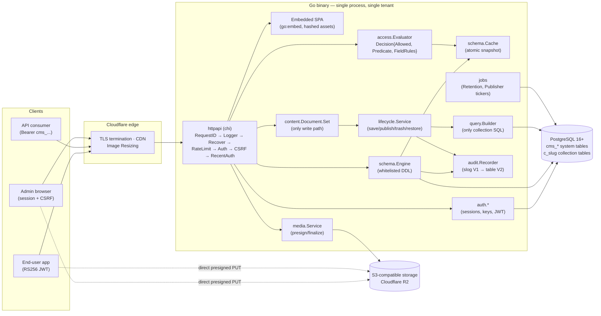
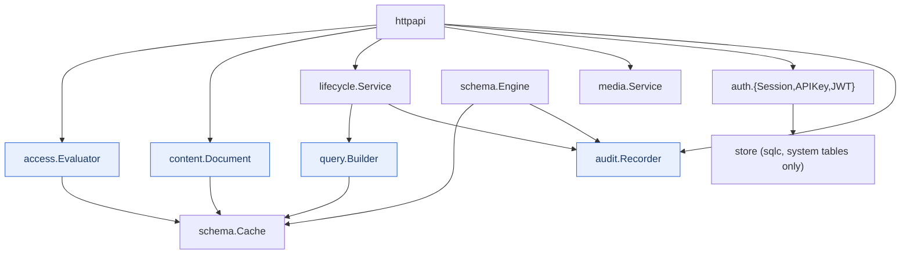
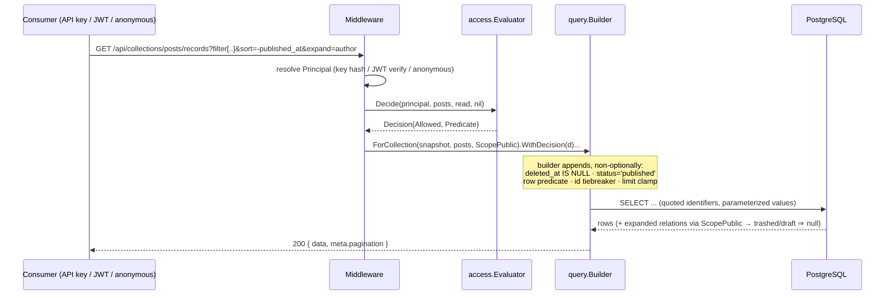
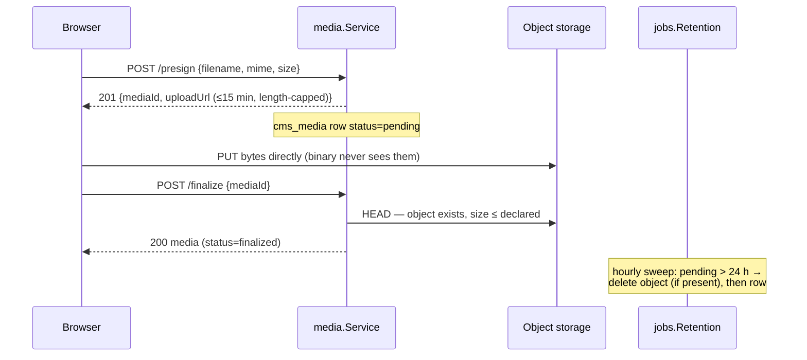
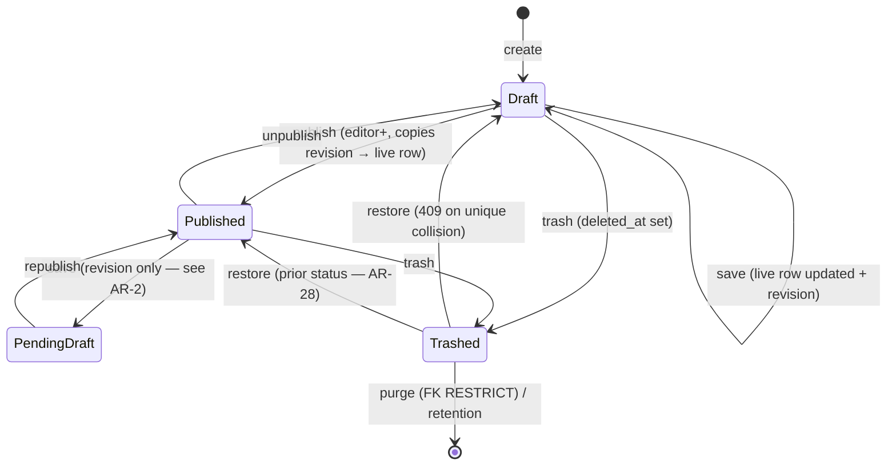
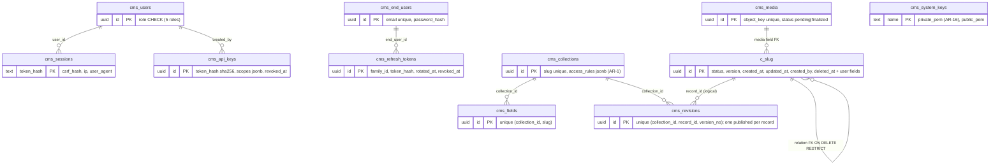
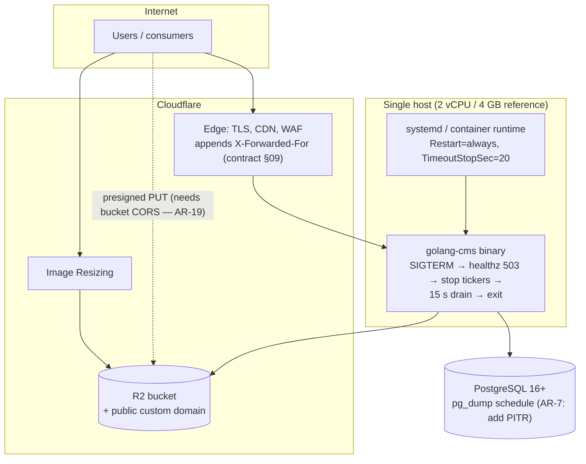

# golang-cms — Principal Architecture Review

**Date:** 2026-07-11 · **Reviewer:** Claude (principal-architect review) · **Scope:** `docs/BUSINESS_RULES.md`, `docs/REQUIREMENTS.md`, `docs/architecture/00–11` · **Status of system:** documentation complete, implementation not started.

Findings carry identifiers `AR-#` and a severity: **Blocker** (resolve before implementation), **High** (resolve during V1), **Medium** (schedule deliberately), **Low** (nits and doc defects). Every finding names the document and, where possible, the exact sentence it challenges.

---

## 1. Executive Summary

golang-cms is a headless, single-tenant CMS in one Go binary: runtime-defined collections materialize as real Postgres tables through a whitelisted DDL engine, content flows out through REST to API-key and JWT consumers, and an embedded Svelte 5 SPA administers it. PostgreSQL 16+ and S3-compatible storage are the only runtime dependencies — by rule, not by accident.

**The design is substantially better than typical pre-implementation documentation.** The invariant discipline (BR identifiers with named enforcement points, a CI trace gate binding tests to rules), the closed DDL whitelist, the single-SQL-surface rule, default-deny RBAC, and the edge-case register with citation obligations are genuinely strong engineering. The three-release sequencing rationale ("V1 builds the load-bearing walls") is correct: revisions, trash filtering, optimistic locking, and the audit seam are exactly the things that cannot be retrofitted.

**The review nevertheless finds five blocker-level defects** that must be resolved before code is written, because each sits inside a load-bearing contract:

1. **The access-rule language is never specified** (AR-1). The `access_rules` JSONB — the input to the security core — has no schema, no example, and a vocabulary (roles) that cannot express rules for `end_user`, `api_key`, or `anonymous` principals, all of which the API layer says it must govern.
2. **The optimistic-locking contract contradicts itself for published records** (AR-2). "The live row does not change" (07) and "version increments every write" (07/BR-LIFE-7) cannot both hold; as written, concurrent pending-draft edits are either unprotected or produce unique-violation races instead of clean 409s.
3. **The concurrency claims about Postgres locking are factually wrong** (AR-3). `ALTER TABLE` rewrites take `ACCESS EXCLUSIVE`; "reads proceed via MVCC" (03, EC-12) is not true — public reads stall behind type changes and FTS rebuilds.
4. **The proxy-trust rule fails in the recommended topology** (AR-4). With Cloudflare fronting a public origin — the deployment doc's own example — the rightmost-non-private rule ignores `X-Forwarded-For` entirely and rate-limits all legitimate users into shared per-edge-IP buckets.
5. **No account recovery exists anywhere, and the dependency rule forbids the usual fix** (AR-5). Neither admins nor end users can reset a password; BR-RUNTIME-2 excludes email delivery; a locked-out sole super admin requires manual database surgery. F-11 ("the CMS acts as the user store") is not deliverable as specified.

**Verdict: conditionally approved.** The foundation is sound and the philosophy is coherent; none of the blockers requires an architectural rewrite — they require specification decisions. Details in §20.

---

## 2. Architecture Overview

One process, three principals, two dependencies:

- **Control plane** — `schema.Engine` executes whitelisted DDL against per-collection tables (`c_<slug>`) inside advisory-locked transactions; metadata (`cms_collections`, `cms_fields`) lives in system tables and an immutable in-memory snapshot swapped atomically before the lock releases.
- **Content plane** — every write funnels through `content.Document.Set` (validation, mass-assignment defense) into `lifecycle.Service` (live row + append-only `cms_revisions` in one transaction); every read composes through `query.Builder`, the only SQL surface for collection tables, which structurally owns the trash filter, published scope, row predicates, identifier quoting, and pagination clamps.
- **Access plane** — `access.Evaluator.Decide` returns `Decision{Allowed, Predicate, FieldRules}`; the builder constructor requires a Decision, making bypass unrepresentable.
- **Edges** — chi router with a normative middleware order; embedded SPA; presigned direct-to-storage uploads; in-process tickers for retention and scheduled publishing; audit events behind a sink interface (slog in V1, table in V2).

The system's scaling philosophy is explicitly vertical and single-process: in-memory schema cache with no invalidation bus, in-memory rate limiting, in-process jobs. Several invariants (BR-RUNTIME-7's cache-coherency argument, BR-AUTH-11's in-memory setup token) are *only* correct under the exactly-one-process assumption — which makes that assumption itself a contract that nothing currently enforces (AR-9).

---

## 3. Requirement Gaps

Missing, ambiguous, or conflicting requirements discovered by cross-reading the four contract layers.

| ID | Sev | Gap |
|---|---|---|
| AR-1 | **Blocker** | **Access-rule schema undefined.** BR-RBAC-2 says rules are "JSONB config for read/create/update/delete"; 02 defines the `Decision` output; no document defines the *input*: the JSONB shape, the predicate vocabulary beyond one example (`ownerOnly`), how a rule addresses principal kinds other than admin roles, or the API-key `scopes` JSONB shape. 04's route map requires rules to govern "writes per API-key scope or end-user access rules" — but `hideFromRoles`/`readOnlyForRoles` are keyed on the five *admin* roles, which end users and API keys do not have. The single most security-critical data structure in the system has no specification and no worked example. |
| AR-5 | **Blocker** | **No credential recovery.** No password-reset flow for `cms_users` or `cms_end_users`; no email capability is permitted (BR-RUNTIME-2, O-9); BR-AUTH-11 bootstrap fires only when `cms_users` is *empty*. Consequences: (a) a forgotten sole-super-admin password means manual DB surgery with no documented runbook; (b) F-11's "CMS as the user store" ships a registration/login system with no recovery path, which no real client application can accept. Options: an admin-driven reset (super admin sets a one-time reset token surfaced in the UI), a documented CLI/flag recovery mode for the super admin, and/or deferring end-user recovery to V2 webhooks (consuming app sends the email) — but the decision must be made now because it shapes `cms_end_users` columns and route surface. |
| AR-6 | High | **No availability requirement.** N-1…N-11 contain latency, startup, and drain targets but no uptime objective. Single process + stop-replace-start upgrades means every deploy is downtime (bounded by drain + 2 s startup) and every crash is an outage until a supervisor restarts. That is a legitimate design point — but it must be written down (an explicit "~99.5%-class, minutes-of-downtime-per-deploy" statement) so nobody discovers it in production. |
| AR-7 | High | **No RPO/RTO.** 09 specifies `pg_dump` "on schedule" — worst-case data loss equals the dump interval, potentially a full day of content, revisions, and end-user registrations. No point-in-time-recovery guidance (WAL archiving, managed-PG PITR), no restore-drill requirement, no stated objectives. For a system whose entire value is the content in one database, this is the largest unpriced operational risk. |
| AR-8 | Medium | **End-user account lifecycle unspecified.** Registration exists (F-11); missing: email verification (or an explicit decision to skip it), password policy, account deletion/export (see AR-30 GDPR), rate limits on `register` (each call burns Argon2id CPU — a cheap DoS), and duplicate-registration semantics/user-enumeration posture of `register`/`login` error responses. |
| AR-26 | Medium | **Media lifecycle ends at finalize.** No requirement covers deleting media: who may delete, what happens to records referencing the deleted media (`media` columns are FKs — RESTRICT presumably, but unstated), whether the storage object is deleted, and how deletion interacts with revisions that reference the object key. |
| AR-27 | Medium | **DropCollection's blast radius on `cms_revisions` is unspecified.** 03 defines the DDL and the destructive gate; nothing says whether the collection's revision rows (and their `collection_id` FK to the deleted `cms_collections` row) cascade, orphan, or block the drop. The BR-SCHEMA-7 promise that "revisions retain dropped data" silently evaporates if DropCollection cascades — that asymmetry between field drop (data survives) and collection drop (data fate unknown) needs an explicit rule. |
| AR-28 | Low | **Restore-from-trash status semantics implicit.** Restore clears `deleted_at`; the record presumably returns with its prior `status` (a published record un-trashes straight back to public visibility). Probably intended — but it should be stated, because "restore instantly republishes" will surprise editors. |
| AR-29 | Low | **Admin-user deletion semantics unspecified** (persona P-2 "cannot delete super admins" implies deletion exists): session cascade, `created_by` dangling references, audit identity of deleted actors. |
| AR-31 | Low | **Doc-generation artifacts leaked into contracts.** F-2 cites "the prompt's field-type reference"; 11 says scopes "match the generation contract verbatim." Both reference documents that do not exist in the repo. Point them at `07-data-model.md`. |

---

## 4. Constraint Stress-Test Results

Each scenario tested against the documented invariants; verdicts note where the design holds and where it cracks.

**Concurrent schema change vs. writes (EC-1).** Holds *as a correctness story* (advisory lock + table locks + pre-release cache swap), but the doc's description of the availability impact is wrong — see AR-3. The accepted stale-plan 500 window is honest and fine for one tenant.

**Concurrent editors on a pending draft.** **Cracks (AR-2, Blocker).** 07: published record edits "insert revisions only — the live row does not change." Also 07: `version` "increments every write"; BR-LIFE-7's enforcement is compare-and-set on the live row. If the live row truly does not change, there is nothing to CAS and two concurrent editors both pass the version check — the collision then lands on the `(collection_id, record_id, version_no)` unique index as a raw unique-violation race, not a clean 409. If instead system columns *do* increment, the "does not change" sentence is false. The intended contract is almost certainly: *content columns frozen, `version`/`updated_at` always advance, CAS always on `version`* — but the spec must say so, because BR-LIFE-1/2/7 tests will be written against this exact wording.

**Publish vs. concurrent save.** `Publish(recordID, revisionNo)` takes no expected version. Explicitly choosing `revisionNo` makes it mostly benign, but a publish racing an unpublish or a trash has last-write-wins semantics with no conflict signal. Low; document or add an expected-version parameter for symmetry (AR-32).

**10× traffic.** Public reads dominate. Holds on paper *if* filters hit indexes — but `?filter[field][op]` accepts **any** schema field, indexed or not, and `contains` is `ILIKE` with (unstated) leading-wildcard behavior that no B-tree serves. An anonymous client can force sequential scans over 100k-row tables at will, and `meta.pagination.total` implies `COUNT(*)` under filter on every list page. No rate limit is specified for anonymous/public reads (BR-AUTH-6 covers login only), and no `statement_timeout` is specified anywhere. **This is the system's cheapest DoS surface (AR-10, High).** Mitigations that fit the philosophy: restrict filter/sort to `indexed` fields (or auto-index filterable ones), make `total` opt-in or estimated, set `statement_timeout` per query class, add a modest global per-IP limiter for public routes.

**100× traffic.** The architecture cannot scale horizontally — that is a stated design point, but the docs never name the escape valve: **edge caching of public GETs.** Published content behind Cloudflare is the canonical CDN workload, yet no document defines `Cache-Control`/`ETag` semantics for `/api/collections/*` or purge-on-publish (V2 webhooks could drive purges). Designing the public-read cache contract now (even if V1 ships `no-store`) is cheap; discovering at 100× that responses were never cacheable (per-principal predicates, cookies, uncontrolled `Vary`) is not (AR-11, Medium).

**Traffic spikes on auth.** Registration and login burn Argon2id CPU. Login is limited; `register` and `refresh` are not (AR-8). Two vCPUs of Argon2id is a small number.

**Database failure.** Fail-closed startup is right (N-11). At runtime, `/healthz` couples liveness to a DB ping: a supervisor configured `Restart=always` on a failing health check will restart-loop the binary through a DB outage, and a proxy using the same endpoint will take the whole service dark rather than serving the SPA shell with API errors. Split liveness (process up) from readiness (DB reachable) (AR-12, Medium).

**Job failure.** Tickers run as goroutines; a panic in `jobs.Retention` kills the process (the `Recover` middleware protects HTTP only). Tickers need their own panic recovery and error isolation; a retention bug must not be a full-service outage (AR-13, Medium).

**Storage failure.** Presign/finalize degrade cleanly (media features fail, content API unaffected) — good. The orphan sweep deleting objects "when present" then the row is the right order. Nothing to add.

**Restart overlap / accidental second replica.** **Cracks (AR-9, High).** Everything correctness-critical assumes exactly one process: cache coherency (BR-RUNTIME-7 "safe because exactly one process exists"), rate-limit state, the setup token. Yet 09 anticipates overlapping processes (migration lock "waits rather than racing"), and nothing prevents an operator from running two replicas behind a load balancer — the natural ops move this design forbids. Replica 2 would serve **stale access rules indefinitely** after a permission change: a silent security failure, not a performance one. Cheapest fix consistent with the philosophy: acquire a process-lifetime advisory lock (`pg_advisory_lock` on a session held for the process's life) before opening the listener; a second process fails fast with a clear log line. One line of design, closes the whole class.

**Clock skew.** Scheduled publishing and JWT TTLs use one process + one DB; skew between app host and DB host affects `publish_at` comparisons and token expiry marginally. Use DB time (`now()`) for publish comparisons; state it (Low, AR-33).

**Large datasets.** 100k rows/collection × 50 revisions × ≤256 KB snapshots: `cms_revisions` is the growth center (potentially tens of GB across collections). Retention prunes per record, but nothing bounds `richText`/`json` field size on write, so a single paste can create 10 MB snapshots ×50 (AR-34, Low: add a max-field-size validation in `Document.Set`). Also unbounded: `cms_sessions` and `cms_refresh_tokens` — expired rows are never cleaned (retention job's three duties don't include them) (AR-14, Medium). The in-memory rate-limit maps keyed by email and IP are unbounded-cardinality; an IPv6 /64 holder can grow the map without limit — bound with LRU (AR-15, Medium).

**Long-running operations.** Startup catch-up (step 5, 09) publishes every missed record *before* the listener opens; after a long outage with many scheduled records, startup time is unbounded and N-5's 2 s target quietly dies. Bound the pre-listener batch or move catch-up to just-after-listen (log-visible either way) (AR-35, Low). Note also that step 5 runs a V2 feature (BR-LIFE-9) in an unconditional V1 startup list — tag it.

**Graceful shutdown.** The 15 s drain with force-close is well specified, but N-6/BR-RUNTIME-6 promise "the drain drops **zero** accepted requests" while 09 defines a force-close path that by construction drops any request older than 15 s. The invariant as worded is unachievable; reword to "zero dropped among requests completing within the window" or the trace-gated test will be written against a false promise (AR-36, Low).

**Network partitions / multi-region.** Out of scope by design (single region, single process); the review accepts this given the honest single-tenant framing — provided AR-6 makes the availability consequence explicit.

---

## 5. Architecture Strengths

Named explicitly, because implementation should protect these:

1. **Rule-to-code traceability with a CI gate** (`make trace`). Binding every non-structural invariant to a named test, and failing the build otherwise, is best-in-class governance most teams never achieve.
2. **Structural invariants.** Making bypass *unrepresentable* (builder requires a `Decision`; `Document.Set` is the only write path; `QuoteIdent` is the only identifier path; `WriteError` is the only error writer) is much stronger than review-enforced convention.
3. **Closed DDL whitelist + two auditable DDL surfaces.** The `schema.Engine` switch plus static migrations, with slugs validated twice, is the right shape for runtime DDL — the single most dangerous feature in the system.
4. **Default-deny RBAC and server-side permission resolution** (identity-only JWTs). Correct call; stale-token privilege is designed out.
5. **The live-table/revisions contract.** Live row for reads, append-only JSONB history, partial unique indexes binding uniqueness to live rows, four-rule drift mapping on restore — coherent and mostly complete (modulo AR-2).
6. **Edge-case register with citation obligation.** Fifteen enumerated failure modes with named resolving documents; a doc touching a subsystem without citing its ECs is "incomplete" by rule. Rare and valuable.
7. **Honest trade-offs.** The accepted EC-1 stale-plan window, offset-pagination cap with a documented boundary, "latency targets stop binding" beyond sizing assumptions, no-down-migrations with restore-from-backup — the docs say what they *don't* do, which is the mark of a real design.
8. **Middleware order as a business-rule surface** (rate limit before Argon2id; CSRF after session) with change control.
9. **Sequencing rationale.** V1 carries revisions/trash/locking/audit precisely because they can't be retrofitted; V2/V3 verifiably reopen no V1 contract.

---

## 6. Architecture Weaknesses

The blockers (AR-1…AR-5) plus the structural weaknesses:

- **The exactly-one-process assumption is a contract with no enforcement** (AR-9) — and it is load-bearing for security (access-rule cache), not just performance.
- **The public read path trusts the schema more than the workload** (AR-10): any field filterable, `contains` unindexable, `COUNT(*)` per page, no statement timeout, no anonymous rate limit.
- **Key custody is weaker than the rest of the auth design** (AR-16, High): the RS256 *private* key sits plaintext in `cms_system_keys`. The design hashes session tokens, API keys, and refresh tokens precisely so a DB read yields nothing replayable — then stores the one credential that mints arbitrary end-user identities in the clear in the same database (and in every `pg_dump`). No rotation procedure, no `kid` claim, no JWKS/public-key endpoint exists for any party that must verify tokens. Minimum: encrypt the PEM at rest with a key derived from an env secret; add `kid` now (free before launch, painful after); document rotation.
- **`CMS_SESSION_SECRET` has no defined function** (AR-17, Medium): the session cookie is a 256-bit random value verified by hashed DB lookup; "cookie signing" (05) adds nothing to that scheme. Either the cookie is opaque (delete the variable) or it is signed for some stated purpose (define it). An env var with an undefined security role invites misuse. Relatedly, the session-token hash function is unspecified (sha256 is fine for 256-bit random input — say so; Argon2 here would be wrong).
- **V1 admin UX ceiling on large collections** (AR-18, Medium): BR-API-1's offset cap (10,000) applies to *all* list endpoints, cursors are V2 and scoped "public API" (F-27), and search is V2. A V1 admin of a 100k-row collection can reach rows beyond 10,100 only through filters on whatever happens to be filterable. Either exempt/raise admin scope, pull cursors into V1 admin lists, or accept and document the ceiling.
- **Media hardening is thinner than the rest of the security model** (AR-19, High): presign validates size only. No MIME/content-type allowlist, and the presign policy doesn't bind `Content-Type` — an authenticated admin (or a leaked write-scope key) can upload `text/html` to a public bucket domain: stored-XSS/phishing hosted on the site's media origin. Also unstated: the R2 bucket **CORS policy** required for browser direct PUT (without it, UAC-1.5 fails on the first demo), and the requirement that the media domain not share origin with the admin UI. Finally, 06's CSP `default-src 'self'` with no `img-src` carve-out for `R2_PUBLIC_BUCKET_URL` blocks the media library's own previews — the two documents contradict each other.
- **Audit in V1 is only as durable as stdout** (AR-20, Low-by-decision): destructive operations have no queryable trail until V2. Acknowledged trade-off; name it in REQUIREMENTS so it's a decision, not a surprise.
- **The setup token contradicts hard rule 6** (AR-21, Low): "never log tokens" vs. BR-AUTH-11 "logs a single-use setup token." Deliberate and defensible — but write the exception into the rule, and add a TTL (e.g., 30 min) so an unconsumed token in shipped logs doesn't stay live until next restart.

---

## 7. Mermaid Architecture Diagrams

### 7.1 High-Level Architecture



### 7.2 Component Dependencies (from 02)



### 7.3 Admin Content Mutation (sequence)

```mermaid
sequenceDiagram
    participant A as Admin browser
    participant M as Middleware chain
    participant E as access.Evaluator
    participant D as content.Document.Set
    participant L as lifecycle.Service
    participant P as PostgreSQL
    participant R as audit.Recorder

    A->>M: PATCH /api/admin/collections/posts/records/{id}<br/>(cookie + X-CSRF-Token + expected version)
    M->>M: RequestID → Logger → RateLimit
    M->>P: session lookup by token hash (BR-AUTH-2)
    M->>M: CSRF validate (BR-AUTH-4)
    M->>E: Decide(principal, posts, update, record)
    E-->>M: Decision{Allowed, Predicate, FieldRules}
    M->>D: Set(snapshot, collection, FieldRules, input)
    D-->>M: Document (unknown fields dropped, read-only rejected)
    M->>L: Save(doc, expectedVersion)
    L->>P: BEGIN; UPDATE live row WHERE version = expected;<br/>INSERT cms_revisions(version_no+1); COMMIT
    alt version mismatch
        P-->>L: 0 rows updated
        L-->>A: 409 conflict (BR-LIFE-7)
    else success
        L->>R: Emit(content.record.update)
        L-->>A: 200 { data, meta }
    end
```

### 7.4 Public Read (sequence)



### 7.5 Authentication Flows (three principals)

```mermaid
flowchart TD
    subgraph admin["Admin (session)"]
        A1["POST /api/admin/auth/login<br/>email + password"] --> A2["Argon2id verify"]
        A2 --> A3["Set-Cookie cms_session (random 256-bit)<br/>DB stores hash only · body carries csrfToken"]
        A3 --> A4["mutations: X-CSRF-Token<br/>destructive: re-auth within 4h"]
    end
    subgraph key["API consumer"]
        K1["Authorization: Bearer cms_..."] --> K2["sha256 lookup in cms_api_keys"]
        K2 --> K3["Principal{api_key, Scopes}"]
    end
    subgraph jwt["End user (JWT)"]
        J1["POST /api/auth/login"] --> J2["RS256 JWT (15 min, identity only)<br/>+ opaque refresh token (hashed, family_id)"]
        J2 --> J3["access.Evaluator resolves permissions<br/>per request — never from claims"]
    end
```



### 7.6 Refresh Rotation and Reuse Detection (EC-8)

```mermaid
sequenceDiagram
    participant U as Client
    participant S as /api/auth/refresh
    participant P as cms_refresh_tokens

    U->>S: refresh(R1)
    S->>P: R1 valid, not rotated → rotate
    S-->>U: JWT2 + R2 (same family_id)
    U->>S: refresh(R2)
    S-->>U: JWT3 + R3
    Note over U,P: attacker replays stolen R1
    U->>S: refresh(R1) — already rotated
    S->>P: revoke entire family_id
    S-->>U: 401 unauthorized (whole family dead;<br/>legitimate client re-authenticates)
```

### 7.7 Media Upload (EC-9)



### 7.8 Record Lifecycle States



### 7.9 System-Table Relationships



### 7.10 Deployment & Infrastructure



### 7.11 Schema Change Flow (EC-1)

```mermaid
sequenceDiagram
    participant A as Admin
    participant H as httpapi/admin
    participant E as schema.Engine
    participant P as PostgreSQL
    participant C as schema.Cache

    A->>H: POST change (destructive: recent-auth + typed slug)
    H->>H: validateSlug (regex + blocklist)
    H->>E: Apply(op)
    E->>E: re-validate (defense in depth)
    E->>P: BEGIN; pg_advisory_xact_lock(schema_key)
    E->>P: whitelisted DDL (quoted identifiers)
    Note over P: ACCESS EXCLUSIVE on the table —<br/>rewrites block reads AND writes (AR-3)
    E->>P: update cms_collections / cms_fields
    E->>P: COMMIT (DDL + metadata atomic)
    E->>C: build + atomically swap successor snapshot
    Note over E,C: swap precedes lock release (BR-RUNTIME-7)
    E-->>A: 200 (audit event emitted)
```

---

## 8. Tech Stack Validation

| Decision | Verdict | Notes |
|---|---|---|
| **Go, single binary, modular monolith** | ✅ Right | Package seams in 02/10 are a textbook modular monolith; microservices would be malpractice at this scope. Import-rule enforcement should be automated (`depguard`/`go-arch-lint` in CI), not left to review (AR-37, Low). |
| **PostgreSQL 16+, real tables per collection** | ✅ Right, with eyes open | Real columns beat EAV/JSONB-blob designs for query performance and integrity. Costs accepted: DDL locks (AR-3), 200-field cap, migration coupling. Sound trade. |
| **Runtime DDL via closed whitelist** | ✅ Right shape | The dangerous feature done as safely as it can be done. Keep the whitelist closed forever. |
| **chi router** | ✅ Fine | Idiomatic, minimal. |
| **squirrel behind `query.Builder`** | ✅ Fine | Marked replaceable, single import site. |
| **sqlc for system tables only** | ✅ Excellent split | Static/typed where schema is static; builder where dynamic. |
| **pgx pool** | ⚠️ Unspecified | No pool sizing, no `statement_timeout`, no `http.Server` timeouts anywhere in the docs (AR-10/AR-38). These are one-paragraph specs; write them. |
| **Argon2id, hashed tokens at rest** | ✅ Right | Parameters (memory/iterations) unspecified — pin them in the auth doc so tests can trace them (Low). |
| **RS256 identity-only JWTs** | ✅ Acceptable | Rationale documented. Missing `kid`, rotation, and at-rest custody (AR-16). |
| **Svelte 5 + Vite, go:embed, no SvelteKit** | ✅ Right | Matches the one-artifact philosophy; cache-busting contract is well designed. |
| **Tiptap JSONB canonical** | ✅ Right | Server-side HTML in V2 from the same canonical form; never store HTML. |
| **In-process tickers, no queue** | ✅ Consistent | Correct under the dependency rule; needs panic isolation (AR-13) and a durable-webhook answer in V2 (AR-22): a `cms_webhook_deliveries` outbox **table** is Postgres-only and thus permitted — use the DB as the queue rather than accepting silent at-most-once delivery across restarts. |
| **slog-only observability in V1** | ⚠️ Acceptable, one addition | Log-derived dashboards fit the philosophy, but N-3/N-4 are p95 targets nobody can verify without latency aggregation; commit to a log-pipeline recipe or a `/metrics` endpoint gated by the same minimalism debate. At minimum, `duration_ms` is present — document the queries. |
| **UUIDv7 app-generated** | ✅ Right | Insert locality + no sequence coupling. |

---

## 9. Integration Validation

No implementation exists yet (repo contains docs and skills only), so drift detection is not applicable. Integration seams reviewed on paper:

- **Cloudflare R2 presigned PUT from browsers requires a bucket CORS policy** — never mentioned; UAC-1.5 fails without it. Add to 09's checklist (part of AR-19).
- **Cloudflare as edge vs. the XFF trust rule** — see AR-4 (Blocker). If Cloudflare connects to a *public* origin address, the rule ignores XFF and keys limits on Cloudflare egress IPs; if a local reverse proxy (nginx/caddy on the host) sits between, the rule works. The docs must either mandate the local-proxy topology or add explicit trusted-proxy support (`CMS_TRUSTED_PROXY_CIDRS`, or `CF-Connecting-IP` behind an opt-in flag). "No configuration" is a nice goal; wrong rate-limit keys in the blessed topology is a shipped incident.
- **Cloudflare Image Resizing** — fine as a delegation; note it binds media delivery to Cloudflare specifically while storage is "S3-compatible"; document the non-Cloudflare fallback (serve originals).
- **Stripe (V3)** — webhook signature verification requires the raw request body (interacts with any body-buffering middleware) and idempotent order transitions under webhook retries/out-of-order delivery. Reserve these constraints in the V3 scope note now (Low).
- **`/healthz` semantics** vs. supervisors and proxies — split liveness/readiness (AR-12).

---

## 10. Scalability Assessment

**Design point:** one process, vertical scaling, ~100k rows/collection, 2 vCPU reference. Within that envelope the read path (indexed, partial-index-backed published scope, capped pagination) should meet N-3/N-4 — *if* AR-10's holes are closed (unindexed filters, per-page `COUNT(*)`, no statement timeout).

**Ceilings, stated honestly:**

- **Compute:** Argon2id + TLS-at-edge + JSON serialization on 2 vCPU supports roughly hundreds of public reads/sec, not thousands. The multiplier is edge caching (AR-11) — design the cache contract now.
- **Writes:** every save = live-row CAS + revision insert in one transaction; fine to thousands/day, irrelevant beyond (editorial workloads don't write fast).
- **Horizontal:** impossible by construction (in-memory cache, in-memory limits, in-process jobs, single-writer assumptions). This is a *decision*, and AR-9's process-lifetime lock makes it a safe one instead of a latent incident. If the product ever needs >1 replica, the documented upgrade path is: move rate limits + cache invalidation to Postgres (LISTEN/NOTIFY) — no third dependency needed. Worth one paragraph in 11-roadmap as the known escape hatch.
- **Database:** single PG instance; read replicas are useless without code awareness and are correctly out of scope. PITR (AR-7) matters far more than replicas at this scale.
- **`cms_revisions`** is the storage growth center; retention bounds count but not size (AR-34).

**10×:** fine with AR-10 fixed. **100×:** only via edge cache; otherwise the answer is "bigger box," which buys ~one order of magnitude. Both should be written into the docs as the official scaling story.

---

## 11. Security Assessment

**Strong:** default-deny RBAC; identity-only JWTs with family-revocation on refresh reuse; hashed sessions/keys/refresh tokens; CSRF with in-memory token; Argon2id behind rate limits; mass-assignment structurally impossible; two-layer slug validation; strict CSP; secrets-never-logged rule with greppable key prefix; middleware order as contract.

**Gaps, in priority order:**

| ID | Sev | Finding |
|---|---|---|
| AR-1 | Blocker | Access-rule/scopes schema undefined — cannot security-review what isn't specified; the evaluator will otherwise be designed ad hoc during implementation, which is exactly how default-allow bugs are born. |
| AR-4 | Blocker | XFF trust rule mis-keys rate limits in the documented Cloudflare topology (lockout of legitimate users; shared buckets). |
| AR-16 | High | JWT private key plaintext in DB + no rotation/`kid`/JWKS. Undermines the otherwise-consistent "DB read yields nothing replayable" posture. |
| AR-19 | High | Media: no MIME allowlist, `Content-Type` unbound in presign, public-bucket stored-HTML risk, CORS unspecified, CSP contradiction with media previews, media-domain origin isolation unstated. |
| AR-10 | High | Anonymous DoS: unindexed filters, `contains` scans, per-page counts, no public-route rate limit, no statement timeout. |
| AR-23 | Medium | **Webhooks (V2) are user-configurable URLs → SSRF.** No document mentions denying private/link-local ranges, re-resolving DNS (rebinding), or egress policy. Must enter the V2 spec before webhooks are designed. |
| AR-8 | Medium | `register`/`refresh` unthrottled (Argon2id CPU burn, table flooding); user-enumeration posture of auth endpoints unspecified; no password policy for either user population. |
| AR-24 | Medium | Login limiter keyed per-email allows targeted admin lockout (attacker burns 10/15 min against a known email). Standard trade-off — consider exempting successful-password attempts or pairing with IP evidence; at minimum document it. |
| AR-21 | Low | Setup token in logs contradicts hard rule 6; codify the exception + TTL. |
| AR-25 | Low | Session fixation/rotation on login and CSRF-token rotation unstated (assumed but tests must trace to a written rule). |
| AR-30 | Medium | **Privacy/GDPR:** `cms_end_users` holds PII for the client app's users; no erasure/export flow, and append-only `cms_revisions` snapshots (which may embed user-generated PII) structurally conflict with right-to-erasure. If any end-user population is EU-resident, this needs a designed answer (e.g., crypto-shredding per user, or documented erasure of revision snapshots as a retention-job capability). |

Threat-model omissions to add to 05 §6: SSRF (webhooks), user enumeration, targeted rate-limit lockout, malicious-media hosting, DB-read → JWT-key compromise.

---

## 12. Reliability Assessment

- **Fail-closed startup** (N-11) and atomic DDL+metadata: right.
- **Single process = no HA**: acceptable *if* AR-6 states it. Supervisor + health endpoint is the whole availability story; make `Restart=always` + backoff explicit in 09.
- **Liveness/readiness conflation** (AR-12): DB blip → restart loops / full dark instead of degraded service.
- **Job isolation** (AR-13): ticker panic kills the service; add per-tick recover + error counters.
- **Retry/idempotency:** optimistic locking covers updates; **creates have no idempotency mechanism** — a server-to-server consumer retrying a timed-out POST duplicates records. Add optional `Idempotency-Key` for public writes, or document at-least-once semantics (AR-39, Medium).
- **Webhook delivery (V2):** in-process retry dies with the process; use a DB outbox (AR-22).
- **Backups:** `pg_dump` + bucket versioning + restore order is a good start; missing PITR/RPO/RTO and a mandated restore drill (AR-7). Note the documented cross-store edge: orphan-sweep deletions after a dump can dangle `object_key` references in a restored DB — bucket versioning covers it *only if* someone writes the recovery step down.
- **Drain contract wording** (AR-36): the zero-drop invariant is falsified by its own force-close path; fix the wording before a trace test enshrines it.
- **Timeout hygiene** (AR-38): no `http.Server` Read/Write/Idle timeouts, no per-request context deadline, no `statement_timeout` anywhere in the docs. One table in 09 fixes this.

---

## 13. Performance Assessment

- **N-3 (≤50 ms single fetch) / N-4 (≤120 ms list p95):** achievable on the reference host with the specified partial indexes — *for indexed access*. The unpriced costs: `COUNT(*)` per list page under arbitrary filters (can exceed the entire 120 ms budget alone at 100k rows), unindexed filter scans, `contains` ILIKE (leading-wildcard unservable by B-tree; if `contains` matters, add `pg_trgm` — bundled contrib, so N-9-compatible — or restrict the operator). AR-10 covers the fixes; additionally make `total` opt-in (`?count=exact` else omit or estimate).
- **Sort stability:** the mandated `id` tiebreaker needs composite indexes `(field, id)` to avoid incremental-sort penalties on large pages; 07 specifies single-column B-trees per indexed field. At 100k rows this is likely fine but worth a benchmark gate (Low, AR-40).
- **Relation expansion:** one level, `ScopePublic` — specify batched loading (single IN query) vs. per-row lookups to avoid N+1 at limit 100 (Low, AR-41).
- **DDL latency:** type changes and V2 FTS rebuilds rewrite tables under `ACCESS EXCLUSIVE` (AR-3): at 100k rows expect seconds of *full* unavailability for that collection (reads included). Correct the docs' claim, log durations (already specified), and state the guidance ("run heavy schema changes off-peak") honestly.
- **Session `last_seen_at`:** written per admin request; trivial at this scale, debounce if it ever shows up in profiles (note only).
- **Perf verification gap:** N-3/N-4 have no corresponding test harness anywhere (the CI gate is correctness-only). Add a `make bench` seeded-database target and run it before each release gate (AR-42, Medium).

---

## 14. Maintainability Assessment

**Excellent.** One package per contract seam; dependency direction documented and mechanically checkable; two vendored decisions (squirrel, storage SDK) explicitly marked replaceable with single import sites; generated code committed; forward-only migrations; tests co-located with build-tagged integration; the trace gate keeps docs and tests honest. The docs themselves are versioned, cross-referenced, and carry an authority chain.

Improvements:

- **Automate the import rules** (AR-37): `depguard`/`go-arch-lint` in CI. "Enforceable by import review" is good; enforced by CI is better and matches the trace-gate ethos.
- **API versioning policy is absent** (AR-43, Medium): external consumers integrate against `/api/collections/*`; there is no `/v1/` prefix and no compatibility promise. Decide *now* — a version prefix (or a documented "additive-only, envelope-stable" policy) costs nothing pre-implementation and is expensive to retrofit. Recommendation: prefix public routes `/api/v1/...`; the envelope and error registry become versioned contracts.
- **No OpenAPI spec** (AR-44, Low): P-6 integrators need one; generate from route definitions or hand-maintain in `docs/`. Also a natural home for the (currently missing) request-body size limits and filter grammar.
- **Missing runbooks** (AR-45, Low): key rotation (blocked on AR-16), super-admin recovery (blocked on AR-5), restore drill (AR-7), "collection table hot DDL" guidance (AR-3).

---

## 15. Technical Debt Assessment

Debt knowingly taken (acceptable, priced):

| Item | Severity | Impact | Mitigation |
|---|---|---|---|
| Offset pagination in V1, cursors in V2 | Low | Deep-list inefficiency, bounded by cap | Already planned (F-27); extend cursors to admin scope (AR-18) |
| slog-only audit in V1 | Low | No queryable trail until V2 | Sink interface already isolates the change; name the gap in REQUIREMENTS (AR-20) |
| Accepted EC-1 stale-plan 500 window | Low | Rare admin-visible error | Documented and audited — fine |
| In-memory rate limits reset on restart | Low | Brief post-deploy vulnerability window | Acceptable; bound the maps (AR-15) |
| No down migrations | Low | Recovery = restore | Consistent with model; depends on AR-7 being fixed |

Debt taken *unknowingly* (the review's job):

| Item | Severity | Impact | Mitigation |
|---|---|---|---|
| Undefined access-rule language (AR-1) | **Blocker** | Security core designed ad hoc during coding | Specify schema + examples + principal-kind semantics before implementation |
| Optimistic-lock contradiction (AR-2) | **Blocker** | Lost-update races on pending drafts; wrong tests enshrined | One-paragraph contract fix in 07 + BR-LIFE-7 |
| Wrong locking claims (AR-3) | **Blocker** (doc-level) | Ops surprises: "zero-impact" rebuilds stall public reads | Correct 03; add duration guidance; consider CONCURRENTLY paths for V2 FTS |
| XFF rule vs. Cloudflare-direct (AR-4) | **Blocker** | Broken rate limiting in blessed topology | Trusted-proxy CIDRs or CF-Connecting-IP opt-in, or mandate local proxy |
| No account recovery (AR-5) | **Blocker** | Product-incomplete auth; operational lockouts | Decide recovery mechanism now (shapes tables + routes) |
| Single-process assumption unenforced (AR-9) | High | Silent stale-ACL replica if ever scaled | Process-lifetime advisory lock |
| JWT key custody (AR-16) | High | DB read mints identities; no rotation | Encrypt at rest, add `kid`, write rotation runbook |
| Public-read DoS surface (AR-10) | High | Cheap anonymous CPU/IO exhaustion | Indexed-only filters, opt-in counts, statement timeout, public rate limit |
| Media hardening (AR-19) | High | Stored-HTML on media origin; demo-blocking CORS gap | MIME allowlist, bind Content-Type, CORS + origin-isolation spec, CSP fix |
| Session/refresh-token table growth (AR-14) | Medium | Unbounded growth, slow lookups | Add cleanup to `jobs.Retention` |
| Webhook SSRF + delivery loss (AR-22/23) | Medium (V2) | Internal-network probe; silent event loss | Outbox table + private-range deny — put in V2 spec now |
| GDPR/erasure vs. append-only revisions (AR-30) | Medium | Compliance exposure if EU end users | Design erasure capability into retention job |

---

## 16. Risk Matrix

Likelihood × impact, post-mitigation owner noted.

| # | Risk | Likelihood | Impact | Sev | Primary mitigation |
|---|---|---|---|---|---|
| AR-1 | Evaluator built without a rule spec → authz bugs | High (certain if unaddressed) | Critical | Blocker | Write the access-rule schema doc |
| AR-2 | Pending-draft lost updates / unique-violation races | Medium | High | Blocker | Fix 07/BR-LIFE-7 wording; CAS always on live `version` |
| AR-4 | Legit-user lockout via mis-keyed rate limits | High (in CF-direct topology) | High | Blocker | Trusted-proxy mechanism |
| AR-5 | Admin lockout; unusable end-user auth product | High (eventually certain) | High | Blocker | Recovery flows |
| AR-3 | Ops runs "safe" rebuild, public API stalls | Medium | Medium | Blocker (doc) | Correct claims, guidance |
| AR-10 | Anonymous DoS via filters/counts | Medium | High | High | Query hardening bundle |
| AR-16 | DB leak → forged end-user JWTs | Low | Critical | High | Key encryption + rotation |
| AR-19 | Hostile file on media origin / broken uploads demo | Medium | Medium | High | Media hardening bundle |
| AR-9 | Second replica serves stale ACLs | Low | Critical | High | Process-lifetime lock |
| AR-7 | Day-scale data loss on DB failure | Low | Critical | High | PITR + stated RPO/RTO |
| AR-6 | Stakeholder surprise at deploy downtime | High | Low | Medium | Write the SLO |
| AR-12/13 | Restart loops; job panic kills service | Medium | Medium | Medium | Health split; ticker recover |
| AR-14/15 | Unbounded table/map growth | High (slow) | Low | Medium | Retention additions; LRU |
| AR-22/23 | V2 webhook SSRF / silent loss | Medium | Medium | Medium | V2 spec additions now |
| AR-30 | GDPR erasure conflict | Depends on market | Medium | Medium | Erasure design decision |
| AR-39/43 | Duplicate creates; unversioned API | Medium | Medium | Medium | Idempotency keys; `/api/v1` |

---

## 17. Recommended Improvements

Consolidated, with rationale (details in the findings above):

1. **Specify the access-control input language** (AR-1): `access_rules` JSONB schema, predicate vocabulary, principal-kind semantics (admin roles / api_key scopes / end_user / anonymous), API-key `scopes` shape, at least three worked examples (public blog, ownerOnly comments, key-scoped ingestion). Add to 05 or a new `12-access-rules.md`.
2. **Repair the live-row/version contract** (AR-2): "system columns (`version`, `updated_at`) advance on every save including pending drafts; content columns freeze while published; CAS is always on live `version`." Update 07 + BR-LIFE-7 enforcement wording.
3. **Correct the locking narrative** (AR-3) in 03 (EC-1 item 2, EC-12): rewrites block reads; add expected-duration guidance and consider trigger-maintained tsvector + `CREATE INDEX CONCURRENTLY` (outside the txn, with reconciliation) as the V2 alternative if collections grow.
4. **Fix proxy trust** (AR-4): add `CMS_TRUSTED_PROXY_CIDRS` (empty = current heuristic) or explicit `CF-Connecting-IP` support behind an env flag; update 05 §5 and 09's contract.
5. **Design account recovery** (AR-5): documented super-admin recovery mode (env-gated one-time reset token at startup mirrors the BR-AUTH-11 pattern); admin-initiated resets for other admins; end-user reset delegated to the consuming app via V2 webhooks or a documented V1 limitation.
6. **Enforce single-instance** (AR-9): process-lifetime advisory lock before listener open.
7. **Harden the public read path** (AR-10): filter/sort restricted to `indexed`+`unique` fields; `total` opt-in; `statement_timeout`; baseline anonymous per-IP limit; specify `http.Server` timeouts and request-body caps (AR-38).
8. **Key custody** (AR-16): encrypt `private_pem` with an env-derived key; add `kid` to JWTs now; rotation runbook; decide whether a JWKS endpoint ships (needed the moment any party other than the CMS verifies tokens).
9. **Media hardening** (AR-19): MIME allowlist; sign `Content-Type` into the presign; bucket CORS spec in 09; require media domain ≠ admin origin; fix 06's CSP to include `img-src 'self' <media-domain>`.
10. **Retention additions** (AR-14): purge expired `cms_sessions` and dead `cms_refresh_tokens`; bound rate-limit maps (AR-15).
11. **Reliability hygiene**: liveness/readiness split (AR-12); ticker panic recovery (AR-13); reword N-6 (AR-36); idempotency keys for public creates (AR-39).
12. **Ops completeness**: PITR + RPO/RTO + restore drill (AR-7); availability statement (AR-6); runbooks (AR-45); `make bench` against N-3/N-4 (AR-42).
13. **API governance**: `/api/v1` prefix + compatibility policy (AR-43); OpenAPI document (AR-44); resolve the BR-API-1 "400" vs. registry (which has no 400 code — validation_failed is 422) contradiction (AR-46, Low).
14. **Edge cache contract for public reads** (AR-11): even if V1 ships `Cache-Control: no-store`, decide the cacheability rules now (anonymous-only, `Vary` discipline, purge-on-publish path) — it is the only 100× story this architecture has.
15. **Pre-plan V2 safely** (AR-22/23): webhook outbox table + SSRF egress rules into the V2 scope text today.
16. **Doc fixes**: AR-21 (setup-token exception + TTL), AR-17 (define or delete `CMS_SESSION_SECRET`), AR-27 (DropCollection vs. revisions), AR-28 (restore status), AR-31 (prompt-reference leftovers), 08's "only unauthenticated non-SPA endpoint" claim (public reads and `/api/auth/*` are also unauthenticated) (AR-47, Low).

---

## 18. Priority Action Plan

**Immediate — before any implementation begins (spec-only changes):**
1. AR-1 access-rule specification (largest blocker; shapes evaluator, handlers, admin UI).
2. AR-2 version/CAS contract fix (one paragraph, prevents wrong trace tests).
3. AR-3 locking-claim correction (one section rewrite).
4. AR-4 proxy-trust decision (env design, two doc edits).
5. AR-5 account-recovery design (routes + columns depend on it).
6. AR-46/BR-API-1 error-code reconciliation, AR-17, AR-27, AR-31, AR-36 (fast wording fixes in the same editing pass).

**Short-term — during V1 implementation:**
7. AR-9 single-instance lock; AR-12 health split; AR-13 ticker recovery.
8. AR-10 + AR-38 query/timeout hardening bundle; AR-15 bounded limiter maps.
9. AR-16 key encryption + `kid`; AR-19 media hardening + CORS; AR-14 retention additions.
10. AR-43 `/api/v1` prefix; AR-39 idempotency keys; AR-42 bench target; AR-6/AR-7 ops docs (SLO, RPO/RTO, runbooks AR-45).
11. AR-18 decision on admin pagination beyond 10k.

**Long-term — V2/V3 planning inputs:**
12. AR-22 webhook outbox + AR-23 SSRF rules written into V2 scope before webhook design starts.
13. AR-11 edge-cache contract (can land with V2 webhooks for purge-on-publish).
14. AR-30 GDPR erasure decision before end-user population grows.
15. AR-8 end-user lifecycle completion (verification, policy, deletion) alongside V2.
16. V3 reservations: Stripe raw-body/idempotency constraints; playback-token spec.

---

## 19. Open Questions for Stakeholders

1. **What does `access_rules` actually look like?** (AR-1) Please provide or approve a concrete JSONB schema including non-admin principals. Confidence in the whole security posture is limited until this exists.
2. **Recovery policy** (AR-5): is admin-initiated end-user password reset acceptable for V1, deferring self-service to V2 webhooks? Who is allowed to recover a sole super admin, and by what mechanism?
3. **Deployment topology** (AR-4): will a local reverse proxy always sit between Cloudflare and the binary, or must the binary trust Cloudflare directly? The rate-limiter design depends on the answer.
4. **Availability & data-loss tolerance** (AR-6/7): what downtime per deploy and what RPO is acceptable to the tenant? ("Minutes and hours" vs. "seconds and seconds" changes nothing architecturally today but must be written down.)
5. **Is any end-user population expected to be EU-resident?** (AR-30) Erasure design is cheap now, expensive later.
6. **Admin experience at 100k rows in V1** (AR-18): accept the 10k-offset ceiling, or pull keyset cursors into V1 admin lists?
7. **Public API cacheability** (AR-11): may anonymous published reads be cached at the edge (with V2 purge-on-publish), or must every read be origin-served?
8. **`CMS_SESSION_SECRET`** (AR-17): what is it for? If nothing, remove it from the fourteen-variable contract.
9. **DropCollection semantics** (AR-27): should a collection drop also destroy its revision history, or must revisions survive as an export-only archive?
10. **Verification of N-3/N-4** (AR-42): is a seeded benchmark a release-gate requirement, or best-effort?

---

## 20. Final Architecture Verdict

**Conditionally approved — proceed to implementation only after the Immediate items land.**

This is a well-architected system *for its stated goals*: the single-binary, two-dependency, invariant-driven design is coherent, honestly bounded, and unusually well governed (the BR trace gate alone puts it ahead of most production systems). The modular-monolith seams are correct, the dangerous feature (runtime DDL) has the right containment shape, and the roadmap sequencing protects the contracts that cannot be retrofitted.

The blockers are specification defects, not architectural ones — an undefined security-core input language (AR-1), a self-contradictory concurrency contract (AR-2), an incorrect claim about Postgres locking (AR-3), a proxy-trust rule that fails in its own blessed topology (AR-4), and a missing account-recovery story that the dependency rule makes non-obvious to fix (AR-5). All five are resolvable in days of documentation work, and all five would be materially more expensive to discover mid-implementation, because this project's own trace discipline would enshrine the defective wording in named tests.

Two strategic notes for the owner. First, the exactly-one-process assumption is this design's deepest invariant — enforce it mechanically (AR-9) and document the Postgres-only escape hatch (LISTEN/NOTIFY + DB-backed limits) so future scaling pressure has a sanctioned path instead of an improvised one. Second, the only 100× lever a single binary has is the edge — the public-read cache contract (AR-11) deserves a design decision now even if V1 ships uncached.

With the Immediate list resolved, this design is a sound foundation for V1.
