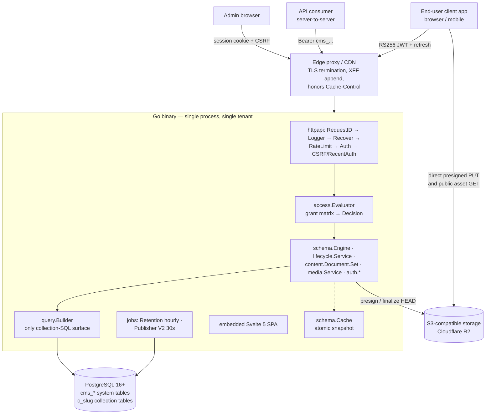
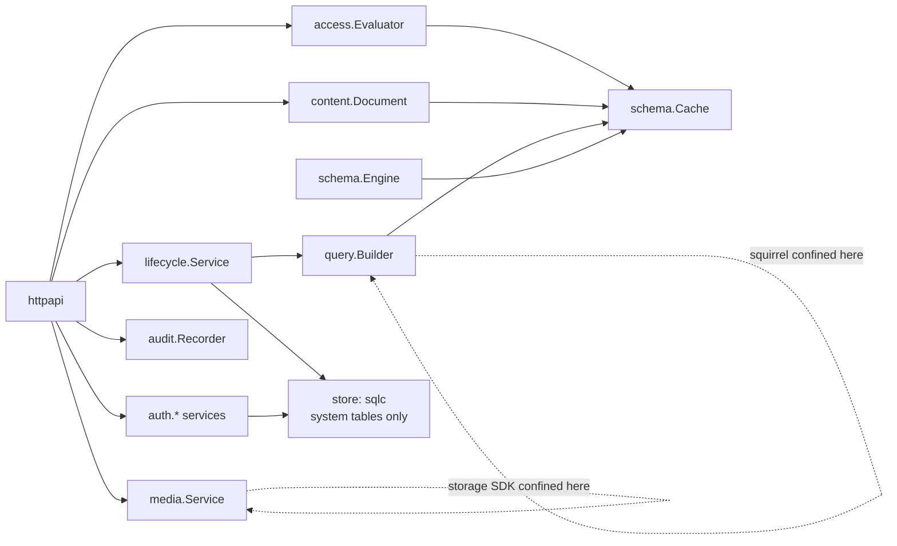
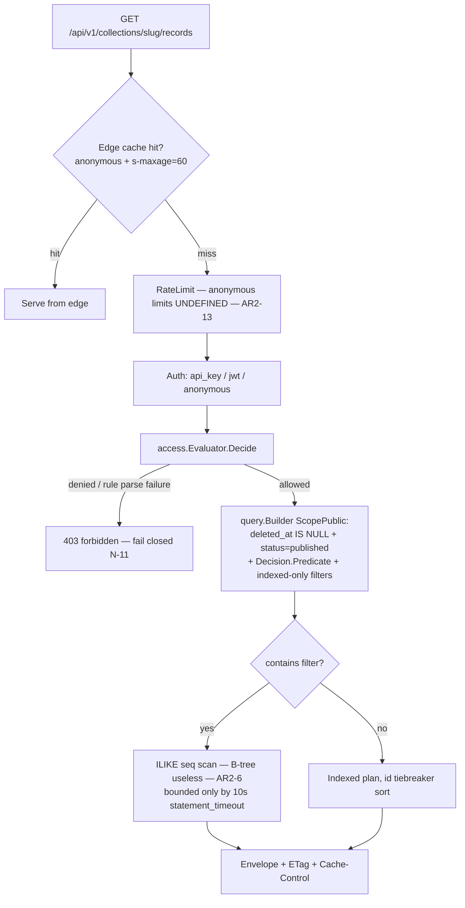
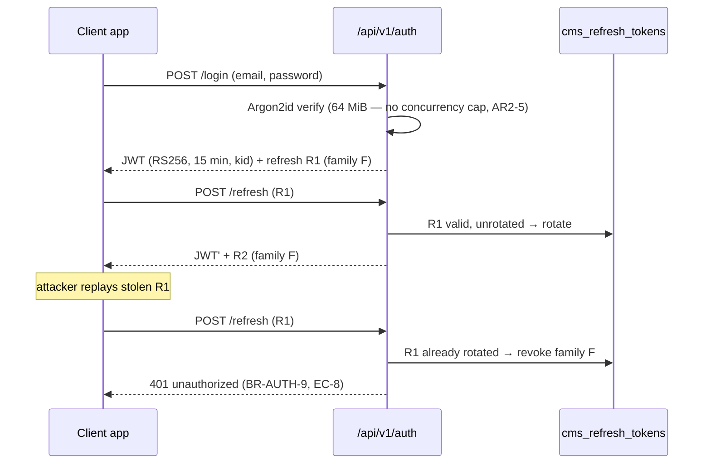
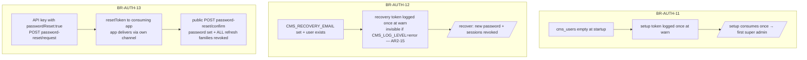
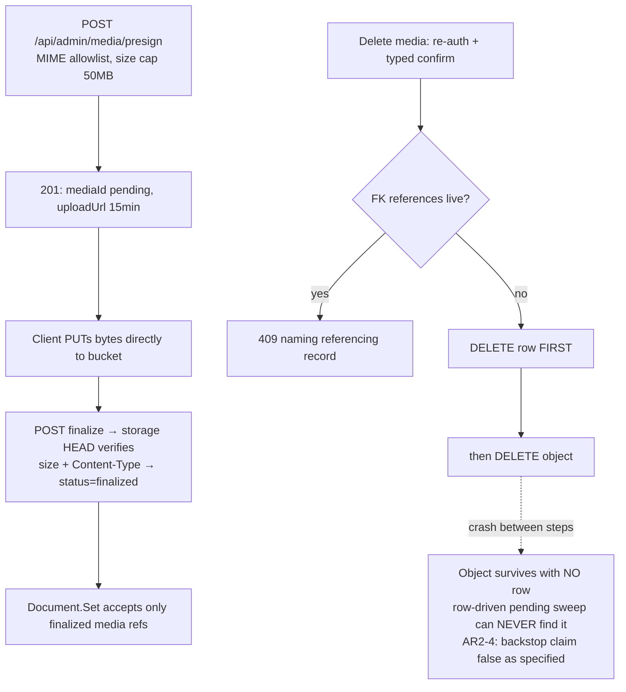
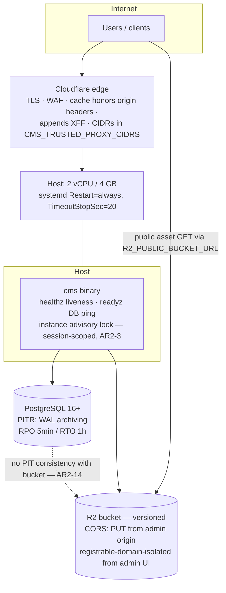
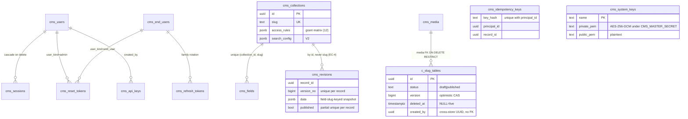

# golang-cms — Principal Architecture Review, Round 2

**Date:** 2026-07-11 · **Reviewer:** Principal Systems Architect (adversarial re-review) · **Scope:** the complete v1.1 documentation set — `docs/BUSINESS_RULES.md`, `docs/REQUIREMENTS.md`, `docs/architecture/00–12`, `docs/api/openapi.yaml` — as remediated per `docs/reviews/architecture-review-2026-07-11.md` (Round 1, AR-1…AR-47) and its Resolution Status table.

**Posture:** skeptical, not validating. Round 1's fixes are treated as claims to be verified, not achievements to be admired. New findings carry `AR2-n` identifiers.

---

## 1. Executive Summary

The v1.1 documentation set is a different class of artifact from what Round 1 reviewed. All five Round-1 blockers are genuinely resolved: the access-rule language now exists as a closed, evaluable grant matrix (`12-access-rules.md`); the optimistic-locking contract is internally consistent across BUSINESS_RULES, 02, and 07; the Postgres locking claims in 03 are now correct, including the SHARE ROW EXCLUSIVE exception for `ADD FOREIGN KEY`; proxy trust is deterministic and fail-safe; and three distinct credential-recovery paths exist with coherent token mechanics. The document set is unusually internally consistent for its size, and the EC-register citation discipline held up under adversarial cross-reading.

It is not done. This review finds **2 blocker-class gaps, 4 High, 8 Medium, and 13 Low findings (27 total, AR2-1…AR2-27)**. The two blockers sit exactly where V1 implementation would start:

1. **The public write path has no content lifecycle** (AR2-1). No document specifies the `status` of a record created through `/api/v1`. If creates land as `draft` (the only reading the docs support), then an end user who posts a comment can never read it back (`ScopePublic` is published-only), no API key can ever publish it (key scopes exclude `publish` by design), and the publish floor at `editor` means every piece of end-user-generated content requires manual admin publication. The normative "comments" worked example in `12-access-rules.md` §2 is unimplementable end-to-end as specified.
2. **CORS for `/api/v1` does not exist** (AR2-2). The architecture's own persona table says end-user JWT clients are *browsers* on other origins. A browser cannot send `Authorization: Bearer` cross-origin without a CORS preflight contract, and none is specified anywhere — only the media *bucket's* CORS is designed. This also interacts unresolved with BR-API-5's edge caching (`Vary: Origin`).

Beyond the blockers, the strongest residual risks are operational-reliability holes in the single-instance story (the instance lock is weaker than BR-RUNTIME-8 claims — AR2-3), one internal contradiction that survived Round 1's fix wave (the media-deletion "orphan sweep backstop" cannot work as specified — AR2-4), and two DoS vectors that the Round-1 fixes narrowed but did not close (Argon2id memory amplification — AR2-5; `contains` filters defeating the indexed-only public-filter rule — AR2-6). One Round-1 resolution (AR-15, bounded rate-limiter maps) was claimed in the disposition table but never landed in any normative document (AR2-8).

**Verdict (Section 20): CONDITIONALLY APPROVED FOR V1 PLANNING.** Resolve AR2-1 and AR2-2 with a short spec addendum before writing the V1 Phase-1 implementation plan; schedule the High items into V1 tasks; everything else is trackable.

---

## 2. Architecture Overview

One statically linked Go binary; one tenant; PostgreSQL 16+ and S3-compatible storage as the only dependencies (BR-RUNTIME-2). Admins define collections at runtime; `schema.Engine` provisions real Postgres tables (`c_<slug>`) through a closed DDL whitelist under a global advisory lock, with an atomically-swapped in-memory schema cache. Content flows: every write through `content.Document.Set` → `lifecycle.Service` (live row + JSONB revision in one transaction, optimistic-locked); every collection read through `query.Builder` (the sole collection-SQL surface, carrying non-disableable trash/published/predicate invariants). Three principal classes (admin sessions + CSRF, API keys, end-user RS256 JWTs with rotating refresh tokens) resolve through `access.Evaluator` against a closed grant-matrix vocabulary. The admin UI is an embedded Svelte 5 SPA. Deployment is stop-replace-start behind an edge proxy, single instance enforced by a process-lifetime advisory lock, ~99.5% availability class accepted (N-13), PITR-backed RPO ≤ 5 min / RTO ≤ 1 h (N-12).

The design's defining trade: **operational minimalism over availability and horizontal scale, bought back with edge caching and strict fail-closed semantics.** Round 2 confirms this trade is now honestly documented; the findings below are where the documentation still overclaims or underspecifies it.

---

## 3. Requirement Gaps

| # | Gap | Consequence |
|---|---|---|
| G-1 | **Initial `status` of publicly-created records is unspecified** (feeds AR2-1). F-6 defines draft→published for admin flows; nothing defines it for `/api/v1` creates. | The entire end-user write feature (F-11, F-12 `endUsers` grants) has an undefined outcome. |
| G-2 | **No CORS requirement for the public API** (feeds AR2-2). P-7 is defined as a browser client; no F/N requirement covers cross-origin access. | UAC-1.5's end-user flow cannot run from a real browser app on its own origin. |
| G-3 | **No registration kill-switch.** Every deployment exposes open `POST /api/v1/auth/register` whether or not the site uses end users. No env var, no per-instance toggle (16-var table is declared exhaustive). | Unwanted open user-store on content-only deployments; abuse surface with no off switch. |
| G-4 | **No admin management surface for `cms_end_users`.** The route map (04) has `/api/admin/users` for admins only. No list, disable, ban, force-logout, or delete for end users until V2 erasure (F-33). | An abusive or compromised end user cannot be stopped in V1 — their refresh-token families cannot even be revoked by an operator through any specified route. |
| G-5 | **N-13's ~99.5% availability target has no SLI.** 08 ships logs only; no external probe, no uptime measurement mechanism is required anywhere. | The one availability number in the spec is unverifiable. |
| G-6 | **No alerting requirements.** 08 mentions "log-based alerting survives the upgrade" but defines zero alert conditions (drain force-close, instance-lock failure, retention skips, late publishes are all *logged*, never *alerted*). | Operators discover failures by reading logs after the fact. |
| G-7 | **Connection-pool sizing absent.** 09 pins every timeout as a compiled-in constant but says nothing about pool max-conns — the parameter that determines blast radius during DDL stalls (AR2-10). | Unbounded or default pool behavior under the exact contention scenarios 03 documents. |
| G-8 | **Ambiguity: which of the 16 env vars are required vs optional** (09 says startup "validates required variables" without marking which). S3 vars required even for a media-less deployment? | Startup-validation behavior unimplementable as specified. |

---

## 4. Constraint Stress-Test Results

**10× traffic (reads).** Holds *if* the edge honors BR-API-5. The 60-second `s-maxage` + SWR contract offloads anonymous reads almost entirely. Two leaks: (a) unique query-string combinations are distinct cache keys — an attacker iterating `filter[views][gte]=<n>` values gets a 100% miss rate against origin with fully "legal" indexed queries (AR2-13); (b) `contains` filters produce non-indexable `ILIKE '%…%'` scans even on indexed fields — 10-second `statement_timeout`-bounded sequential scans of 100k rows, a few of which concurrently saturate the 2 vCPU reference host (AR2-6).

**10× traffic (writes).** Single Postgres, single process; write throughput is bounded by revision-snapshot write amplification (every save = live-row CAS + full JSONB snapshot insert). At the 256 KB snapshot design point this is fine; at the permitted 5 MiB request / 1 MiB-per-field ceiling, sustained API-key ingest doubles as a WAL firehose that also stresses the PITR RPO ≤ 5 min target (archiving must keep up). Not disqualifying; unquantified.

**100× traffic.** The architecture *explicitly refuses* to scale here (N-13, BR-RUNTIME-8 forbids a second process). This is now honestly documented — the correct answer for the product's positioning. The stress test therefore reduces to: does the system degrade or die? With statement timeouts, body caps, fail-closed evaluation, and per-request deadlines, it degrades — except for the Argon2id path, where concurrent password verifications at 64 MiB each have no concurrency bound and can OOM the 4 GB host outright (AR2-5). That is a die, not a degrade.

**Database failure.** `/readyz` flips 503, proxy stops routing; clean. But Postgres *restart* interacts badly with BR-RUNTIME-8: the session-scoped instance lock evaporates with the connection while the binary keeps serving — the "exactly one process" invariant that BR-RUNTIME-7's cache-coherency argument depends on is now unenforced until the binary notices, and nothing in the docs says it must notice (AR2-3).

**Process crash.** Transactions make data safe. But the dead process's Postgres session can linger past its death (kernel TCP keepalive defaults reach minutes-to-hours); the replacement then "fails startup immediately with a clear log line" per BR-RUNTIME-8 — under systemd `Restart=always`, that is a crash-loop until Postgres reaps the ghost session, silently burning the RTO budget (AR2-3).

**Storage (R2) outage.** Presign/finalize fail with envelope errors; delivery URLs are client-fetched so reads of existing media bypass the binary entirely. Graceful. Unstated: `Finalize`'s storage HEAD has no timeout listed in 09's table.

**Schema change under load.** The 03 lock analysis is now correct, but incomplete operationally: DDL waiting for ACCESS EXCLUSIVE queues *behind* in-flight reads while *all new* queries on that table queue behind the DDL. Collection `statement_timeout` (10 s) bounds the blocker, so worst case ≈ 10 s full stall + rewrite time — but those queued requests hold pool connections, and the pool is shared across collections, so one collection's ALTER can starve every other collection's queries. No `lock_timeout` on the schema transaction, no pool-size spec (AR2-10).

**Retry/idempotency.** The `Idempotency-Key` design exists but is underspecified at exactly the points where idempotency mechanisms fail in production: concurrent first-requests, same-key-different-payload, transactional coupling of the key row to the record insert, and replay semantics after the record has been mutated or purged (AR2-9).

**Event ordering / race conditions.** Publish-vs-unpublish races remain last-write-wins (Round 1's AR-32, accepted). Restore-vs-concurrent-create unique collisions are handled (EC-6). The `/setup` and `/recover` single-use tokens need atomic consume-once semantics — implied, not stated; acceptable as implementation detail.

**Multi-region / network partition.** Out of scope by design (single instance, single region); the docs no longer pretend otherwise. Partition between binary and Postgres = full outage, honestly priced into N-13.

---

## 5. Architecture Strengths

1. **The invariant discipline is real.** Closed sets everywhere: DDL whitelist, error-code registry, grant-matrix keys, audience lists, filter operators, audit-action vocabulary. Closed sets are testable and fail loudly; this is the single strongest property of the design.
2. **Structural enforcement over convention.** `query.Builder` requiring a `Decision` at construction makes RBAC bypass unrepresentable; `Document.Set` as the only write path kills mass assignment by construction; the Go build failing on missing embeds makes a stale-UI binary unrepresentable.
3. **The BR-traceability gate** (`make trace`, N-10) turns the rules manual into an enforced contract rather than aspirational prose. Few projects of any size have this.
4. **Honest trade-offs.** N-13 (availability), AR-24 (targeted lockout), the 60-second cache propagation window, and the field-drop/collection-drop revision asymmetry are all *stated as accepted costs* with reasoning — the hallmark of a reviewable architecture.
5. **The three-principal separation** (sessions/keys/JWTs with three threat models) is correctly drawn, and the token hygiene (hashed at rest everywhere, family revocation, kid rotation, encrypted private key) is genuinely good.
6. **The live-table/revisions contract** is a clean solution to draft-vs-published with exactly one table read on the hot path and derivable pending-draft state.
7. **Fail-closed as a system property** (N-11): malformed rules deny, startup aborts on partial state, unlisted proxies degrade rather than fail open.

---

## 6. Architecture Weaknesses (Findings AR2-1…AR2-27)

### Blocker-class

**AR2-1 — The public write path has no content lifecycle. (Blocker)**
No document specifies what `status` a record receives when created via `POST /api/v1/collections/{slug}/records`. The only supported reading (07: "Never-published record. `status='draft'`") produces a dead end:

- An end user with `create` (`endUsers: "all"` or `"own"`) creates a record → it is a draft.
- Their reads are `ScopePublic` (12 §3 step 3) → published-only → **the author cannot read their own record back**. The create returns 201 with a body; every subsequent GET is 404.
- No public principal can publish it: key scopes exclude `publish` by design (12 §6), the publish floor is `editor` (BR-LIFE-3), `end_user`/`anonymous` never receive `publish` (12 §3).
- Therefore every piece of end-user-generated content — including the comments in 12 §2's *normative* worked example — requires a human admin to publish it, one record at a time, and is invisible even to its author until then. The same applies to the "ingestion target" example: an API key with `create` but `draftAccess: false` writes records it cannot read, and nothing can ever make them public without manual admin action per record.

This is not an implementation detail; it decides the product. Options (pick one, per collection): (a) a grant-object key like `"createStatus": "published"` allowing designated collections to auto-publish public creates (floor-compatible: it's an admin-authored rule, not a principal privilege); (b) `endUsers`/key reads include *own* drafts (`created_by = principal` bypasses the published filter for owners); (c) keep as-is and document that public creates are moderation-queue-only — which contradicts 12 §2's comments example and must change that example. Recommendation: (a) + the owner-draft read carve-out of (b); both are small, closed additions to the matrix vocabulary.

**AR2-2 — No CORS design for `/api/v1`. (Blocker)**
05's principal table: public JWTs are for "browser/mobile end-user clients." A browser on `app.example.com` calling `api.cms.example.com/api/v1/...` with `Authorization: Bearer` triggers CORS preflight; without `Access-Control-Allow-Origin`/`-Headers`/`-Methods` handling, **every browser-based end-user client fails on its first request**. The only CORS text in the corpus covers the media bucket (09). Required decisions: allowed-origin configuration (a 17th env var, or per-instance config — conflicts with "the sixteen-variable table is exhaustive"), preflight route handling, and the caching interaction: `Access-Control-Allow-Origin` echoing a request Origin on a response cached under BR-API-5's `s-maxage=60` serves the wrong ACAO to the next origin unless responses add `Vary: Origin` (or use ACAO `*`, which is compatible with the anonymous-only cacheable class since credentialed responses are `no-store`). Recommendation: `*` for anonymous-cacheable GETs, explicit origin allowlist + `Vary: Origin` for credentialed requests; amend BR-API-5 and the env table.

### High

**AR2-3 — BR-RUNTIME-8's instance lock is weaker than its claim, in both directions. (High)**
`pg_advisory_lock` is *session*-scoped: it guarantees at most one *Postgres session* holds it — not at most one serving process.
- *Split brain:* if the lock-holding connection drops (network blip, Postgres restart/failover, aggressive idle-session policies on managed PG), the lock releases while the binary continues serving. A second process can now start successfully. Two live processes silently break BR-RUNTIME-7's justification ("safe because exactly one process exists") — the exact stale-cache scenario Round 1's AR-9 was raised to prevent. Nothing requires the binary to monitor the lock connection and terminate or re-acquire on loss.
- *Ghost lock:* after SIGKILL/host crash, the dead process's session can linger until TCP keepalive reaps it (kernel defaults: tens of minutes). BR-RUNTIME-8 mandates the replacement "fails startup immediately" — under `Restart=always` that is a crash-loop for the ghost's lifetime, burning the RTO ≤ 1 h budget on a routine crash.
Fix (spec-level, cheap): dedicate a connection to the lock with keepalives; on lock-connection loss the process must exit (fail closed); the replacement retries acquisition with bounded backoff for a documented window (e.g., 2 min) instead of hard-failing; 09 documents `tcp_keepalives_idle/interval/count` (or `idle_session_timeout`) guidance for the Postgres side.

**AR2-4 — The media-deletion "orphan sweep backstop" cannot work as specified. (High — internal contradiction)**
07 §Media Deletion: row deleted first, then the storage object; "the orphan sweep (BR-MEDIA-2) is the backstop for the crash window between those two steps." But the sweep, as specified in 07 §Retention step 3 ("sweeps `cms_media` **rows** stuck in `pending` beyond 24 h"), is *row-driven* — once the row is deleted, nothing can ever find the surviving object. BR-MEDIA-2's own wording ("deletes storage **objects** with no finalized media record") implies the opposite, *bucket-driven* reconciliation — a full bucket LIST per hourly tick, with cost and consistency implications no document discusses. The two normative descriptions contradict each other, and only the expensive one makes the backstop claim true. Fix: invert the delete order (object first, then row — the surviving row is the natural retry driver, matching the sweep's existing row-driven shape), or add a `deleting` status so the row persists as a tombstone until object deletion is confirmed. Either way, reconcile BR-MEDIA-2's wording with 07's mechanism.

**AR2-5 — Argon2id memory amplification is an unbounded-concurrency OOM vector. (High)**
Parameters: 64 MiB per verification (05 §1). Policy: `login` and `register` *always* perform one Argon2id verification, even for unknown emails (deliberate, for enumeration resistance). Rate limits are per-email and per-IP only — a distributed attacker with N addresses gets 30·N attempts/15 min, and nothing bounds how many verifications run *concurrently*. Twenty in flight = 1.3 GB on the 4 GB reference host that is also running everything else. The per-request 25 s deadline bounds duration, not admission. Fix: a global semaphore on password-hashing work (e.g., `min(4, NumCPU)` concurrent verifications; excess waits or sheds with 429). One paragraph in 05 §5 + a BR amendment; standard practice.

**AR2-6 — `contains` defeats the indexed-only public-filter rule. (High)**
BR-API-4 (the AR-10 fix) restricts public filter/sort to `indexed`/`unique` fields — but `contains` maps to `ILIKE` with wildcards (04 §Filtering), and a B-tree index cannot serve an infix `ILIKE '%x%'` match. An anonymous caller filtering `contains` on any indexed `text` field forces a sequential scan of the full table, bounded only by the 10 s statement timeout, with unique values busting the edge cache (see AR2-13). A handful of concurrent requests saturates the 2 vCPU host — the exact DoS AR-10 was closed for, resurrected through one operator. Fix options: (a) exclude `contains` from `ScopePublic` in V1 (cleanest — admin/trash scopes keep it); (b) require a `pg_trgm` GIN index on `contains`-enabled fields (pg_trgm is a bundled extension, so N-9 permits it — but 07 must then spec the index and BR-API-4 the gate). Recommendation: (a) now, (b) as the V2 upgrade when FTS lands.

### Medium

**AR2-7 — F-11 is half a user store. (Medium)**
No registration disable switch (G-3) and no end-user admin surface (G-4). V1 ships an open sign-up endpoint and no way to ban, disable, force-logout, or even *list* end users. Minimum V1 fix: `CMS_END_USER_REGISTRATION` (or equivalent) env toggle + an admin route to revoke an end user's refresh-token families and set a `disabled_at`. `cms_end_users` needs the `disabled_at` column now — retrofitting it later is a migration; speccing it now is a row in 07's table.

**AR2-8 — Round 1's AR-15 resolution never landed. (Medium — process finding)**
The Round-1 disposition table records AR-15 (unbounded rate-limiter maps) as "Resolved by spec §4.3 (rate-limiter maps bounded LRU with fixed entry cap)." No normative document contains it: BR-RUNTIME-4 still reads "in-memory token buckets keyed by email and client IP," and 05 §5 says nothing about map bounds. Grep for `LRU`/entry-cap across `docs/BUSINESS_RULES.md` and `docs/architecture/` returns nothing. The unbounded-cardinality memory growth (every distinct IP/email creates a bucket forever) is therefore still the specified behavior. One-sentence fix to BR-RUNTIME-4; also a lesson for the trace process — the disposition table asserted a landing that no grep gate checked.

**AR2-9 — Idempotency-Key semantics stop where the hard cases start. (Medium)**
Unspecified: (a) two concurrent requests with the same key — the second violates the `(key_hash, principal_id)` unique constraint mid-flight; block-until-first-completes, 409, or race? (b) Is the idempotency row written in the *same transaction* as the record? If not, a crash between them re-opens the duplicate window the feature exists to close. (c) Same key, different payload — industry practice (Stripe) is 422; silently returning an unrelated "original result" is a data-corruption foot-gun. (d) Replay after the record was updated/trashed/purged — the table stores only `record_id`, so "returns the original creation result" is unimplementable as written; specify "returns the current representation, 404 if purged" or store the response. (e) Replay status code (201 vs 200). Five sentences fix all of this.

**AR2-10 — No `lock_timeout` on schema transactions; pool coupling unpriced. (Medium)**
09's timeout table has statement timeouts but no `lock_timeout`. A schema change queues behind long reads for up to its full 60 s statement timeout; meanwhile all new queries on that table queue behind the DDL *holding pool connections*, and the shared pool spreads one collection's stall to every collection. Fix: `SET LOCAL lock_timeout` (e.g., 5 s) inside the schema transaction with a retry-and-report loop, plus a pinned pool size and per-scope acquisition budget in 09's constants table (G-7).

**AR2-11 — Index naming and the 63-byte identifier limit are unspecified. (Medium)**
07 gives join tables a deterministic truncation-plus-hash rule; indexes get nothing. With 55-char collection slugs and 55-char field slugs, any `<table>_<field>`-derived index name blows Postgres's 63-byte limit, which *silently truncates* — making distinct indexes collide and corrupting AddIndex's "duplicate index → no-op" detection (which necessarily works by name). RenameField also leaves stale index names unless renaming them is specced. Fix: reuse the join-table rule for index names; state that rename operations rename dependent indexes (or that names are slug-independent, e.g., keyed by field UUID).

**AR2-12 — `number` precision: 03 and 07 disagree. (Medium)**
03's conversion matrix is defined over `number(p,s)` with a precision-widening rule, and the definition model carries "numeric precision where applicable"; 07's storage mapping says bare `number→NUMERIC` (unconstrained). If DDL emits unconstrained `NUMERIC`, the widening rule is meaningless (nothing to widen) and `AddField` ignores declared precision; if it emits `NUMERIC(p,s)`, 07 understates the mapping. The DDL engine is the most safety-critical component — this ambiguity lands exactly there. Pick one (recommend: `NUMERIC(p,s)` when config declares precision, bare `NUMERIC` otherwise; matrix applies to the declared form) and state it in both docs.

**AR2-13 — Anonymous read traffic has no rate limit and `?count=exact` is unrestricted. (Medium)**
BR-AUTH-6 and 05 §5 define limits for `login`/`register`/`refresh` only. Public reads pass `middleware.RateLimit` in the chain, but no document defines any limit for them — and unique filter values are distinct edge-cache keys, so the CDN provides no floor against a deliberate scan. `?count=exact` (an unqualified `COUNT` per request, per 04's own warning) is available to anonymous callers. Fix: a documented anonymous per-IP read limit (generous — e.g., 300/min), and restrict `count=exact` to authenticated scopes.

**AR2-14 — PITR restores the database to T, the bucket stays at now. (Medium)**
The two stores have no point-in-time consistency story: a DB restore resurrects `cms_media` rows whose objects were legitimately deleted after T (dangling delivery URLs) and orphans objects finalized after T (invisible to the row-driven sweep — compounding AR2-4). The restore drill (09) validates the database only. For single-tenant V1 this is acceptable *if stated*: add a paragraph to 09 §Backup ("after PITR restore, run a media-reconciliation pass; dangling references render as 404s") and add bucket-reachability + spot-check of N recent media rows to the drill.

### Low

**AR2-15 —** Setup/recovery tokens log "once at `warn`" — with `CMS_LOG_LEVEL=error` they are silently suppressed and recovery mode becomes unusable with no operator feedback. Force-emit these two lines regardless of level (they are already the sanctioned exception), or document the interaction.
**AR2-16 —** BR-AUTH-2 enumerates session columns without `csrf_hash`; 07's `cms_sessions` includes it and BR-AUTH-4 depends on it. The top-authority doc under-describes its own table.
**AR2-17 —** 01's middleware diagram omits `Recover`, which 04's normative order includes.
**AR2-18 —** BR-RUNTIME-3's canonical startup order omits the instance-lock step that BR-RUNTIME-8, 01, and 09 all place before the listener. Since BUSINESS_RULES wins conflicts by the authority chain, the authoritative order is the incomplete one. Add the step to BR-RUNTIME-3.
**AR2-19 —** 09's V1 startup list includes step 7 (publisher catch-up tick) unconditionally; `jobs.Publisher` is V2 (08, BR-LIFE-9 tag). Vacuous in V1 but a numbered step referencing a component that doesn't exist yet; tag it "(V2)".
**AR2-20 —** Session cookie `Max-Age=604800` (7 days) vs "7 idle / 30 absolute" server expiry: whether the cookie re-issues on activity (sliding) is unstated; without it, a daily-active admin is logged out weekly and the 30-day absolute bound is unreachable.
**AR2-21 —** 09 has runbooks for key rotation and master-secret *loss*, but not master-secret *rotation* (decrypt `private_pem` under old, re-encrypt under new — needs both secrets live for one operation; worth five lines).
**AR2-22 —** CSP lacks `frame-ancestors 'none'` (admin-UI clickjacking) and the standard companions (`X-Content-Type-Options: nosniff`, `Referrer-Policy`).
**AR2-23 —** Advisory-lock key values (migration, schema, instance) are unspecified, and the implicit assumption that golang-cms is the *only* application using this database's advisory-lock keyspace is unstated.
**AR2-24 —** Fields per collection are capped (200); collections per instance are not — schema-cache size, admin-UI rendering, and `pg_class` growth are unbounded by an admin with a loop.
**AR2-25 —** `filter[field][in]` value encoding (comma-separated? repeated params?) and `contains`-on-non-text behavior (422?) are unspecified in 04's grammar.
**AR2-26 —** OpenAPI: `authRegister` returns 200 (creation → 201); idempotent-replay status code unspecified (fold into AR2-9's fix).
**AR2-27 —** BR-API-5 specifies a strong `ETag` but no conditional-request semantics (`If-None-Match` → 304) and no statement of what the ETag hashes; and the whole credentialed-response-safety argument rests on the edge honoring `Vary`/`no-store` — unverifiable as specified. Add 304 semantics and a curl-based cache-contract smoke check to 09's runbooks.

---

## 7. Mermaid Architecture Diagrams

### 7.1 High-Level Architecture



### 7.2 Component / Dependency Diagram (per 02)



### 7.3 Public Read Request Flow



### 7.4 Admin Mutation Sequence

```mermaid
sequenceDiagram
    participant UI as Admin SPA
    participant MW as Middleware chain
    participant EV as access.Evaluator
    participant DS as Document.Set
    participant LS as lifecycle.Service
    participant PG as PostgreSQL
    participant AU as audit.Recorder

    UI->>MW: POST records (X-CSRF-Token, cookie)
    MW->>MW: session hash lookup, CSRF vs csrf_hash
    MW->>EV: Decide(principal, collection, update)
    EV-->>MW: Decision{Allowed, Predicate, FieldRules}
    MW->>DS: Set(snapshot, rules, input)
    DS-->>MW: Document (unknown fields dropped, readOnly rejected)
    MW->>LS: Save(doc, expectedVersion)
    LS->>PG: BEGIN; UPDATE live row WHERE version=$expected;<br/>INSERT cms_revisions(version_no+1, snapshot); COMMIT
    alt version mismatch
        PG-->>LS: 0 rows
        LS-->>UI: 409 conflict (BR-LIFE-7)
    else success
        LS->>AU: Emit(content.record.update)
        LS-->>UI: 200 envelope
    end
```

### 7.5 End-User Auth: Refresh Rotation and Reuse Detection



### 7.6 Recovery and Reset Paths



### 7.7 Schema Change Concurrency (EC-1)

```mermaid
sequenceDiagram
    participant A as Admin request
    participant SE as schema.Engine
    participant PG as PostgreSQL
    participant SC as schema.Cache

    A->>SE: Apply(AddField)
    SE->>PG: BEGIN; pg_advisory_xact_lock(schema key)
    SE->>PG: ALTER TABLE c_posts ADD COLUMN ... (nullable)
    Note over PG: ACCESS EXCLUSIVE — queues reads AND writes<br/>(SHARE ROW EXCLUSIVE for ADD FOREIGN KEY only)<br/>no lock_timeout specified — AR2-10
    SE->>PG: UPDATE cms_fields metadata (same txn)
    SE->>PG: COMMIT (DDL + metadata atomic, BR-SCHEMA-6)
    SE->>SC: build successor snapshot, atomic swap
    Note over SC: swap precedes advisory-lock release (BR-RUNTIME-7)
```

### 7.8 Media Upload and the Deletion Contradiction



### 7.9 Record Lifecycle — with the AR2-1 Dead End

```mermaid
stateDiagram-v2
    [*] --> Draft: admin create<br/>OR public create (status unspecified — AR2-1)
    Draft --> Published: Publish (editor+ ONLY;<br/>no API-key scope, no end-user path)
    Published --> PublishedPendingDraft: edit (revision only,<br/>live content frozen)
    PublishedPendingDraft --> Published: republish
    Published --> Trashed: Trash (deleted_at set)
    Draft --> Trashed: Trash
    Trashed --> Draft: Restore (409 on unique collision)
    Trashed --> Published: Restore (was published —<br/>UI warns: instantly public)
    Trashed --> [*]: Purge (FK RESTRICT enforced)
    note right of Draft
        End-user-created rows park here:
        author cannot read them (ScopePublic),
        no public principal can publish them.
        12 §2 comments example unimplementable.
    end note
```

### 7.10 Deployment / Infrastructure



### 7.11 System-Table ER Diagram



---

## 8. Tech Stack Validation

| Choice | Verdict | Notes |
|---|---|---|
| Go, single binary, `go:embed` | ✅ Right | Matches the one-artifact deployment thesis; cross-compile targets stated (N-2). |
| chi router | ✅ Fine | Boring, stable, middleware-order friendly. |
| pgx + sqlc (system tables) / squirrel (dynamic) | ⚠️ Sound with one caveat | The static/dynamic SQL split is exactly right. Caveat: `Masterminds/squirrel` is in maintenance mode (no active development). The docs already treat it as a replaceable vendored seam confined to `query` — adequate mitigation; just don't let its idioms leak through the Builder contract. |
| PostgreSQL 16+, advisory locks, partial indexes, JSONB | ✅ Right | The whole design leans on real Postgres semantics and now describes them correctly. `pg_trgm` (bundled) is available headroom for AR2-6. |
| Runtime DDL (one table per collection) vs EAV/JSONB-only | ✅ Right trade | Real columns buy real indexes, FKs, and types; the whitelist + advisory lock + safe-conversion matrix contain the risk. This is the product's moat and its riskiest code — the doc treats it accordingly. |
| RS256 / RSA-2048 JWTs | ✅ Acceptable | Rationale documented (library compatibility); `kid` rotation and encrypted private key close Round 1's gaps. |
| Argon2id 64 MiB/3/2 | ⚠️ Parameters fine, admission control missing | See AR2-5. |
| Svelte 5 + Vite SPA, Tiptap JSONB | ✅ Fine | O-5/O-10 boundaries clear; CSP posture good minus AR2-22. |
| Monolith (modular, interface-seamed) | ✅ Right | Microservices would violate the product thesis. The 02 dependency rules + depguard make the modularity mechanical. |
| REST + closed envelope, no GraphQL | ✅ Right | O-12 justified; envelope v1-stability stated. |
| No metrics/tracing in V1 (logs only) | ⚠️ Defensible, but | The BR-RUNTIME-2 minimalism argument is coherent; G-5/G-6 (no SLI, no alert definitions) are the cost. A `/metrics` Prometheus endpoint has zero runtime *dependencies* and would not breach BR-RUNTIME-2's letter — worth revisiting in V2 rather than never. |

**Drift check vs repository:** no implementation exists yet (docs-only repo; `internal/`, `web/`, `Makefile` are all still to be created), so no code drift is assessable. The one repo-level inconsistency: `10-project-structure.md` describes a `Makefile` and layout that must be scaffolded exactly as written or the trace/depguard gates it promises won't exist from day one.

---

## 9. Integration Validation

- **Edge proxy (Cloudflare):** contract is explicit (4 hard requirements in 09). Residual: honoring of `Vary`/`no-store` on `/api/*` is asserted, never verified (AR2-27); CIDR list rot is acknowledged ("refreshed occasionally") but has no drill/runbook entry.
- **S3/R2:** presign/finalize/HEAD flow is tight (MIME allowlist, signed Content-Type, length-range). Gaps: `Finalize` HEAD timeout unstated; deletion-order contradiction (AR2-4); no bucket-side lifecycle policy discussion for version sprawl.
- **Cloudflare Image Resizing (BR-MEDIA-4):** delegation is structural (no imaging libs). Fine.
- **Consuming applications (password reset):** the app-mediated reset API is well-designed — the `passwordReset` scope, the trusted-caller enumeration exception, family revocation on confirm. Gap: nothing rate-limits a leaked `passwordReset`-scoped key minting tokens (it is per-IP-limited at best), and token issuance for a given user has no cap; low severity, worth one line.
- **Stripe / video providers (V3):** name-checked only; correctly out of scope for this review.
- **Browser clients of `/api/v1`:** the missing integration — AR2-2. This is the only named consumer class whose transport-level contract is absent.

---

## 10. Scalability Assessment

Vertical-only by decree (N-13, BR-RUNTIME-8) — reviewed as such.

- **Read path:** strong. Edge cache (60 s + SWR) is the multiplier; keyset cursors exist in the V1 builder; composite `(field, id)` indexes serve the mandatory tiebreaker; offset capped at 10k with cursor escape for admin. Weak points: cache-key cardinality abuse (AR2-13), `contains` scans (AR2-6), anonymous `count=exact`.
- **Write path:** revision write amplification is the structural cost of the versioning contract — accepted, but unbenchmarked; `make bench` (N-3/N-4) covers read latency only. Add a write benchmark to the same gate.
- **Data growth:** retention design is genuinely complete (7 enumerated duties). Unbounded: `cms_end_users` (no cap, no disable — AR2-7), collection count (AR2-24), rate-limiter maps (AR2-8), R2 version history (no lifecycle policy).
- **Schema-cache scaling:** immutable snapshot per change is O(total fields) rebuild — fine at sane collection counts; unbounded collection count makes "sane" unenforced (AR2-24).
- **The ceiling:** one process, one Postgres. At the point the edge cache stops absorbing growth (write-heavy or auth-heavy workloads), the architecture's answer is "bigger host" and then "no." That is a *product decision* the docs now own honestly; V2+ pressure will come from webhooks (fan-out) and FTS (CPU) — both correctly deferred.

---

## 11. Security Assessment

**Strong:** three cleanly separated principal models; hashed-at-rest everything; CSRF double-submit-with-server-state; refresh-family revocation; encrypted signing key with `kid` rotation; default-deny closed grant matrix with fail-closed parsing; mass-assignment structurally impossible; SQL injection controlled at two choke points (QuoteIdent, parameterized values); deterministic proxy trust; enumeration-resistant public auth endpoints; media origin isolation with CSP backing; audit vocabulary closed.

**Gaps, ranked:**
1. **AR2-5** — Argon2id admission control (memory DoS → process death, worst-in-class outcome for the fail-closed philosophy).
2. **AR2-2** — CORS: absence is a *functional* blocker, but misconfiguration under time pressure ("just set ACAO `*` with credentials") is the security risk; spec it now so it isn't improvised.
3. **AR2-7 / G-3, G-4** — an open registration endpoint with no disable and no ban tooling is an abuse platform (spam storage in `endUsers:"all"` create collections, credential-stuffing target list growth).
4. **AR2-6 / AR2-13** — resource-exhaustion DoS through legal queries.
5. **AR2-22** — clickjacking headers; trivial.
6. Positive note: the threat model (05 §6) is now a real, line-item, mitigations-mapped model, including honest "accepted trade-off" entries — rare and good.

**Compliance/privacy:** GDPR erasure specced-now-build-V2 (F-33) with candidly documented limitations; audit durability limitation in V1 stated (F-16). Both are defensible *as documented decisions*. Data-residency, encryption-at-rest for Postgres itself, and PII classification of collection data remain the operator's problem — acceptable for self-hosted single-tenant, worth one sentence in 09 saying so.

---

## 12. Reliability Assessment

- **Startup/shutdown:** fail-closed startup chain and the drain contract (with the force-close honesty fix from Round 1) are solid. AR2-19 is a tag-level nit.
- **Single point of failure:** everything — by explicit decree (N-13). Reviewed accordingly: the question is not "is there an SPOF" but "does the SPOF fail *cleanly*." Mostly yes; the exceptions are AR2-3 (instance-lock split-brain/ghost-lock — the one place the single-instance guarantee itself can silently fail) and AR2-5 (OOM is not clean).
- **Health model:** liveness/readiness split done right (AR-12 fix landed).
- **Jobs:** tick-level panic recovery landed (AR-13); retention duties complete; FK-skip logging specified.
- **Backup/DR:** PITR + portable dump + pre-release restore drill with measured RPO/RTO — this section went from Round 1's worst to one of the best. Residuals: AR2-14 (cross-store PIT consistency) and the drill's DB-only scope.
- **Retries/timeouts:** compiled-in timeout table is complete for HTTP and statements; missing `lock_timeout` (AR2-10) and Finalize-HEAD/storage-call timeouts.
- **Idempotency:** exists, underspecified at the failure edges (AR2-9).
- **Missing entirely:** circuit breaker between binary and R2 (a slow — not down — R2 turns presign/finalize into 25 s-deadline hogs; acceptable V1 risk, name it), and any dead-letter concept for V2 webhooks (the outbox table reservation covers durability; delivery-abandonment policy will be needed).

---

## 13. Performance Assessment

- **Targets exist and are gated** (N-3/N-4 + `make bench` at 100k rows) — the Round-1 fix landed. Gaps: no write-path or publish-path benchmark; no p95 under *concurrent* schema change (the ACCESS EXCLUSIVE stall is the known worst case — bench it deliberately).
- **Query design:** composite `(field, id)` indexes align exactly with the tiebreaker invariant; partial indexes on live rows are the right shape for the trash filter; batched `IN` expansion kills the N+1 (AR-41 landed). `contains`/ILIKE is the one planner-hostile operator (AR2-6).
- **`count=exact`** opt-in default-off is the right call; scope it (AR2-13).
- **Payloads:** body caps, field cap, revision-snapshot sizing assumptions all coherent; 04 documents the JSONB-canonical rich-text decision correctly (server-side render deferred to V2).
- **Connection pool:** the unpriced variable (G-7). Everything else in the latency budget is pinned; pool acquisition under contention is not.
- **Compression:** never mentioned (gzip/br on API responses and the SPA assets). The edge likely handles it; one sentence in 09's proxy contract would close it.

---

## 14. Maintainability Assessment

Excellent, with evidence rather than intention: one-package-per-contract layout mirroring 02's seams; depguard-enforced import rules; two confined replaceable dependencies; sqlc-generated code committed; forward-only migrations with restore-as-rollback stated; BR-traceable tests with a CI gate; docs with an authority chain and a citation convention that survived adversarial cross-reading with only Low-severity drift (AR2-16/17/18).

Risks: (a) the openapi.yaml is hand-maintained and *declared* subordinate — fine — but nothing gates its drift (a CI check that route names/error enums in the yaml appear in 04 would cost little); (b) the Round-1 disposition table proved that "resolved in spec" can silently fail to land in normative docs (AR2-8) — the fix discipline needs a landing-grep per disposition, which is exactly the trace philosophy this project already believes in; (c) `12-access-rules.md` is version-stamped 1.0 while the set is 1.1 — harmless (new doc) but the stamp convention should be stated somewhere.

---

## 15. Technical Debt Assessment

| Item | Severity | Impact | Mitigation |
|---|---|---|---|
| Public-create lifecycle undefined (AR2-1) | **Blocker-class debt if built as-is** | End-user features ship broken; retrofit touches grant matrix, builder, serializer | Spec addendum before V1 plan (Section 18) |
| Instance-lock semantics vs claim (AR2-3) | High | Silent split-brain or crash-loop; erodes the invariant three other rules lean on | Watchdog + bounded retry, spec-level |
| Row-driven orphan sweep vs deletion order (AR2-4) | High | Slow storage leak + a false guarantee in the authority doc | Invert deletion order; reconcile BR-MEDIA-2 wording |
| Hand-maintained OpenAPI, ungated | Medium | Drift is certain over time; integrators build against the stale one | CI consistency check, or generate from route table in V2 |
| squirrel maintenance-mode | Low | Frozen upstream; no CVE channel | Already seam-confined; revisit at V2 |
| V1 audit = stdout durability (AR-20, accepted) | Low (accepted) | Forensic gaps if logs rotate before shipping | V2 `cms_audit_log` already reserved |
| No metrics endpoint (accepted) | Low-Medium | G-5/G-6; ops flies on logs | Reconsider `/metrics` in V2 — no new runtime dependency required |
| Offset pagination retained on public V1 | Low | O(offset) scans up to the 10k cap | Already capped; cursors arrive publicly in V2 (F-27) |
| `created_by` as cross-store unqualified UUID | Low | Join ambiguity admin vs end-user authorship in analytics | Document the disambiguation rule (lookup order) in 07 |

No overengineering found — the V2/V3 deferrals are consistently *specced-now-built-later*, which is the correct way to defer. The underengineering is concentrated in the operational edges listed above.

---

## 16. Risk Matrix

| ID | Risk | Likelihood | Impact | Severity |
|---|---|---|---|---|
| AR2-1 | Public-create lifecycle dead end ships into V1 code | Certain if unaddressed | Product-breaking for F-11/F-12 | **Blocker** |
| AR2-2 | Browser clients cannot call `/api/v1`; CORS improvised late | Certain (first browser client) | Functional failure or security misconfig | **Blocker** |
| AR2-3 | Instance-lock split-brain / ghost-lock crash-loop | Medium (any PG blip/failover) | Stale-cache serving; RTO blowout | **High** |
| AR2-5 | Argon2id concurrency OOM | Medium (cheap to trigger) | Process death — full outage | **High** |
| AR2-4 | Orphaned objects unreachable by sweep | Low per event, cumulative | Storage leak + false doc guarantee | **High** (as contradiction) |
| AR2-6 | `contains` seq-scan DoS on public scope | Medium | Origin saturation | **High** |
| AR2-7 | Open registration, no ban tooling | High (internet default) | Abuse, spam, stuffing list growth | Medium |
| AR2-10 | DDL lock queue + shared pool starvation | Medium (every schema change under load) | Multi-collection latency spike / brownout | Medium |
| AR2-9 | Idempotency edge cases produce duplicates/corruption | Medium | Data integrity on the API path | Medium |
| AR2-8 | Rate-limiter map growth (fix never landed) | Low-Medium | Slow memory exhaustion | Medium |
| AR2-13 | Cache-bust + count=exact origin load | Medium | Degraded reads | Medium |
| AR2-14 | Post-PITR cross-store inconsistency | Low (per restore) | Confusing partial data loss | Medium |
| AR2-11/12 | DDL-engine ambiguities (index names, NUMERIC) | Certain at implementation time | Implementer guesses in the riskiest component | Medium |
| AR2-15…27 | Doc drift, missing headers, unstated semantics | Varies | Individually small | Low |

---

## 17. Recommended Improvements

Consolidated, deduplicated against Section 6; each maps to an edit target.

1. **Extend the grant matrix for public-create lifecycle** (AR2-1): add `createStatus` (or equivalent) to the closed grant-object vocabulary + owner-draft read carve-out; update 12 §1–3, BR-RBAC-2/BR-API-2, 07's contract, and the §2 worked examples so the comments example actually works.
2. **Add a CORS section to 04 + BR-API-5 amendment + env var** (AR2-2): ACAO policy per credential class, preflight handling, `Vary: Origin` rule.
3. **Harden BR-RUNTIME-8** (AR2-3): lock-connection watchdog (exit on loss), bounded acquisition retry on startup, PG keepalive guidance in 09.
4. **Fix media deletion** (AR2-4): object-before-row order (or `deleting` tombstone status); align BR-MEDIA-2's wording with the row-driven sweep.
5. **Password-hashing admission control** (AR2-5): global semaphore, documented in 05 §1/§5.
6. **Remove `contains` from ScopePublic in V1** (AR2-6); note the pg_trgm upgrade path for V2.
7. **Land the rate-limiter bound** (AR2-8): one sentence in BR-RUNTIME-4 (bounded LRU, fixed cap, eviction = forgotten bucket).
8. **Complete the idempotency spec** (AR2-9): five sentences — same-txn insert, concurrent-second-request behavior, key-payload mismatch → 422, replay returns current representation (404 if purged), replay status code.
9. **Schema-txn `lock_timeout` + pool constants** (AR2-10, G-7): add both to 09's compiled-in table.
10. **Index naming rule** (AR2-11) and **NUMERIC precision resolution** (AR2-12) in 03/07.
11. **Registration toggle + minimal end-user admin surface** (AR2-7): env var, `disabled_at` column now, revoke-families admin route.
12. **Anonymous read limit + scope `count=exact`** (AR2-13).
13. **Cross-store restore note + drill extension** (AR2-14).
14. **Low-severity sweep** (AR2-15…27): force-emit bootstrap tokens; BR-AUTH-2 csrf_hash; BR-RUNTIME-3 instance-lock step; 09 step-7 V2 tag; cookie sliding-refresh statement; master-secret rotation runbook; `frame-ancestors` + nosniff; advisory-key values + sole-tenant assumption; collection-count cap; `in`-encoding; OpenAPI 201s; ETag/304 semantics + cache smoke check. One editing pass covers all thirteen.

---

## 18. Priority Action Plan

**Immediate — before the V1 Phase-1 implementation plan is written:**
- AR2-1 (public-create lifecycle) and AR2-2 (CORS) — both are *design decisions*, not edits; run them through the brainstorm→spec gate as a short addendum. Everything downstream (builder, serializer, route table, env vars) depends on them.
- AR2-4 and AR2-8 — pure documentation fixes restoring internal consistency and a claimed-but-unlanded resolution; minutes of work, do them with the addendum.
- AR2-3 — spec the watchdog/retry semantics now (BR-RUNTIME-8 amendment); it changes `app.Run`'s design.

**Short-term — during V1 implementation (task-level, not redesign):**
- AR2-5 (hashing semaphore), AR2-6 (drop public `contains`), AR2-9 (idempotency completeness), AR2-10 (lock_timeout + pool constants), AR2-11/12 (DDL-engine precision), AR2-7 (registration toggle + `disabled_at` + revoke route), AR2-13 (anonymous limits, count scoping), and the Low sweep (AR2-15…27).
- Add a write-path case to `make bench`; add the cache-contract smoke check and CIDR-refresh entry to 09's runbooks.

**Long-term — V2 alignment:**
- pg_trgm-backed public `contains`; `/metrics` reconsideration; OpenAPI drift gate (generate or CI-check); media reconciliation job (also closes AR2-14's tail); full end-user lifecycle (verification, self-service deletion — already on the AR-8 deferral list); webhook delivery-abandonment policy on the reserved outbox.

---

## 19. Open Questions for Stakeholders

1. **What is end-user-generated content *for*?** (Decides AR2-1's shape.) If it's moderation-queue submissions, keep drafts and fix the docs/examples; if it's live comments/UGC, the matrix needs `createStatus` + owner-draft reads. This is a product call, not an engineering one.
2. **Will any first-party browser app consume `/api/v1` from a different origin in V1?** If provably not (mobile-only clients), AR2-2 downgrades to High-with-a-documented-assumption; the persona table currently says browsers, so the default answer is yes.
3. **Is the deployment's Postgres exclusively owned by golang-cms?** (AR2-23; also determines whether advisory-key collision needs real namespacing.)
4. **Is systemd `Restart=always` the blessed supervisor?** If yes, AR2-3's ghost-lock crash-loop is the default failure mode of a routine OOM/panic and its fix priority rises.
5. **Should V1 measure its own availability** (G-5) or is N-13 aspirational until V2? An external uptime probe costs nothing and is outside BR-RUNTIME-2's scope entirely.
6. **Media-less deployments:** are the S3 env vars required at startup (G-8)? If yes, say so; if no, define degraded mode (presign routes 503?).

---

## 20. Final Architecture Verdict

**CONDITIONALLY APPROVED FOR V1 IMPLEMENTATION PLANNING.**

The v1.1 documentation set resolves every Round-1 blocker on its own terms, and the resolutions survived adversarial re-verification: the grant matrix is genuinely closed and evaluable, the locking narrative is now Postgres-true, the recovery paths compose, and the operational posture (single instance, PITR, ~99.5%) is honestly priced rather than hand-waved. The invariant discipline — closed sets, structural enforcement, trace gates — remains the strongest property of this design and is better than most shipped systems' documentation.

The conditions are the two blocker-class findings, both of which sit on the public API surface where V1 implementation would begin: **AR2-1** (the public write path has no defined content lifecycle, and the access-rules document's own worked example cannot be implemented as written) and **AR2-2** (no CORS design for the API's stated browser consumers). Neither is large — each is a one-session design decision plus a bounded doc edit — but both change interfaces (grant-matrix vocabulary, response headers, env table) that the first implementation tasks would otherwise freeze incorrectly.

Resolve those two through the project's own brainstorm→spec gate, land the two consistency repairs (AR2-4, AR2-8) and the BR-RUNTIME-8 hardening (AR2-3) in the same editing pass, and schedule the remaining High/Medium items as named V1 tasks. With that addendum committed, this reviewer would upgrade the verdict to **APPROVED** without further re-review of the unaffected documents.

---

*End of Round-2 review. Findings AR2-1…AR2-27; disposition tracking should follow the same table convention as Round 1's Resolution Status.*
