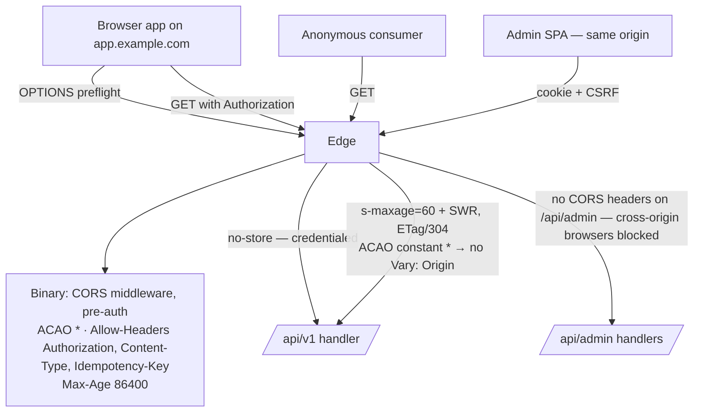
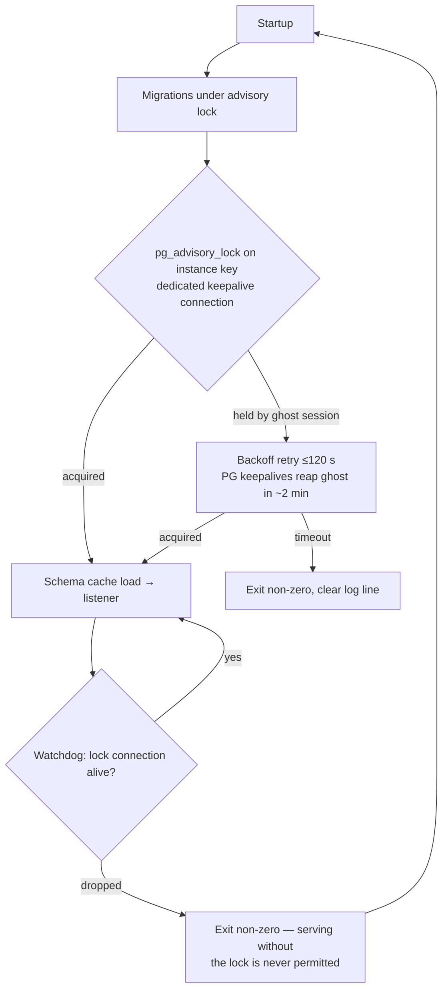

# golang-cms — Principal Architecture Review, Round 3 (Final)

**Date:** 2026-07-11 · **Reviewer:** Principal Systems Architect (adversarial re-review) · **Scope:** the complete v1.2 documentation set — `docs/BUSINESS_RULES.md` (1.2), `docs/REQUIREMENTS.md` (1.2), `docs/architecture/00–12` (1.2 / 12-access-rules 1.1), `docs/api/openapi.yaml`, `CLAUDE.md`, tracked `.claude/skills/*` — as remediated per Round 2's Resolution Status (AR2-1…AR2-27, all dispositioned).

**Posture:** unchanged — Round 2's fixes are claims to verify, and the machinery Round 2 *introduced* is itself the primary attack surface for this round. New findings carry `AR3-n`.

---

## 1. Executive Summary

The v1.2 documentation set closes both Round-2 blockers correctly and completely. The public write path now has a real content lifecycle — `createStatus` is a closed, validated, floor-safe grant key, and owner-draft visibility is specified at every layer that must implement it (business rule, evaluator algorithm, builder invariant, storage contract, acceptance criterion). CORS is designed rather than improvised, and the design (constant wildcard ACAO, no CORS on the admin surface) is the cache-safe, standards-correct choice. All four High-severity fixes landed as specified: the instance-lock watchdog, the media-deletion outbox, the Argon2id admission semaphore, and the public `contains` removal. The Medium/Low sweep landed 21 for 21, including the AR2-8 process repair — the rate-limiter bound that Round 1 claimed and never shipped is now in BR-RUNTIME-4's normative text. Adversarial re-verification of all 27 dispositions found zero regressions, zero stitching errors, and zero new contradictions between documents.

This round's fresh findings are **six: one Medium and five Low (AR3-1…AR3-6)**. The Medium is a performance gap created by the interaction of two correct decisions: `ownerOnly` predicates (Round 1) and owner-draft visibility (Round 2) both compile `created_by` into hot-path queries, but `07-data-model.md`'s default index set contains no `created_by` index — at the 100k-row design point, every credentialed public list degrades to a sequential scan, putting N-4 at risk for exactly the consumer class (end users) the last remediation was built to serve. The fix is one line in the default index set. The five Lows are edge annotations on the new machinery (outbox 404-retry semantics, preflight rate-limit phrasing, idempotency pool-hold, `created_by` cross-store disambiguation, storage-call timeouts).

**Verdict (Section 20): APPROVED — READY FOR V1 IMPLEMENTATION PLANNING.** No blockers, no re-review required. Fold AR3-1 into the Task that provisions default indexes and the Lows into their owning documents' first-touch tasks; the standing stakeholder questions (Section 19) are product/ops choices, not design defects.

---

## 2. Architecture Overview

Unchanged in shape from Round 2's assessment, now with the round-2 machinery integrated: one Go binary, one tenant, PostgreSQL 16+ and S3-compatible storage only. Runtime-DDL schema engine (closed whitelist, global advisory lock, `lock_timeout 5s`, atomic cache swap, 500-collection/200-field caps); `query.Builder` as the sole collection-SQL surface with seven non-disableable invariants including owner-draft-aware `ScopePublic`; `content.Document.Set` as the sole write path; a closed grant matrix (`minRole`, `minRoleOwn`, `endUsers`, `anonymous`, `createStatus`) evaluated fail-closed; three principal classes with an admission-controlled Argon2id core, watchdog-held single-instance lock, media-deletion outbox, 17-variable exhaustive configuration, wildcard-CORS public API behind a 60-second edge-cache contract, PITR-backed DR at RPO ≤ 5 min / RTO ≤ 1 h, ~99.5% availability accepted (N-13).

---

## 3. Requirement Gaps

The remediation closed G-1…G-4 and G-7 from Round 2. Residual, unchanged, and deliberately parked as stakeholder questions rather than defects:

| # | Gap | Status |
|---|---|---|
| G-5 | N-13's ~99.5% availability has no SLI/measurement mechanism | Open — Section 19 Q2; an external probe is out-of-binary and costs nothing |
| G-6 | No alert conditions defined (drain force-close, lock loss, retention skips, late publishes are logged, never alerted) | Open — Section 19 Q2 |
| G-8 | Required-vs-optional env vars unmarked; media-less boot behavior (S3 vars absent) implied only by the `run-and-verify` skill, not by 09 | Open — Section 19 Q3; one table column fixes it |

No new requirement gaps found: F-34/UAC-1.7 give the end-user-management surface a testable acceptance path, and the createStatus/owner-draft semantics are traceable end-to-end (BR-API-2 ↔ 12 §1/§3 ↔ 02 invariant 3 ↔ 07 contract ↔ UAC-1.7).

## 4. Constraint Stress-Test Results

**Re-test of Round 2's failure scenarios against the new machinery:**

- **End-user create → read-back** (the AR2-1 dead end): fixed in both modes. `createStatus: "published"` → live row published + first revision `published=true` in one transaction; default draft → author sees it via owner-draft ScopePublic. The comments worked example is now implementable exactly as written. Verified across 12 §2/§3, BR-LIFE-2, 07.
- **Browser client first request**: preflight OPTIONS answered before auth with constant `*` ACAO; Authorization allowed; `Access-Control-Max-Age: 86400` caps preflight volume. No `Vary: Origin` needed, so the BR-API-5 cache contract is undisturbed. Passes.
- **Postgres restart under BR-RUNTIME-8**: lock connection drops → process exits non-zero (fail closed) → supervisor restarts → startup retries acquisition up to 120 s while the ghost session is reaped (keepalive runbook: ~2 min worst case). The crash-loop and the split-brain are both closed. One residual: a *transient* network blip on only the lock connection now costs a full restart — correct per fail-closed, priced at seconds of N-13 budget. Acceptable.
- **Crash mid-media-delete**: row+queue-row committed atomically; object delete after commit; retention retries queue entries > 1 h. No orphan is unreachable. The Round-2 contradiction is gone from every document (BR-MEDIA-2's wording now matches 07's mechanism). One unspecified edge → AR3-3 (object already absent on retry).
- **Distributed login/register flood**: Argon2id work now bounded at `min(4, NumCPU)` × 64 MiB ≈ 256 MiB; excess waits 2 s then sheds with 429. The OOM vector is closed; enumeration-uniformity is preserved (the semaphore delays, it does not branch on account existence).
- **Anonymous scan abuse**: `contains` gone from ScopePublic; remaining operators are all B-tree-servable **except** the new owner-draft OR-branch for credentialed callers — see AR3-1. Anonymous 300/min/IP and authenticated-only `count=exact` (BR-API-7) bound the residual cache-bust vector.
- **Concurrent idempotent creates**: same-txn key row + unique-index blocking is correct and crash-safe. The blocking second request holds a pool connection for up to the 25 s deadline; with pool max 10, ten pathological duplicates can momentarily exhaust the pool → AR3-4 (Low; self-inflicted by the misbehaving client, bounded by deadlines).
- **10×/100× traffic**: posture unchanged from Round 2 (explicitly vertical, edge-cache-levered, N-13-priced). The two open residuals from Round 2 (cache-key cardinality; write-path WAL pressure vs RPO) stand as accepted, now with the anonymous limiter as a partial mitigation for the former.

**No deadlocks introduced:** the outbox insert and row delete touch one table each in a fixed order inside one transaction; the schema lock ordering (advisory → table lock with `lock_timeout`) is single-holder by construction.

## 5. Architecture Strengths

Carried forward from Round 2 (closed sets, structural enforcement, trace gates, honest trade-offs, three-principal separation, live-table/revisions contract, fail-closed posture) — all still true at v1.2. New strengths this round:

1. **The grant matrix absorbed a product-shaping feature without opening the vocabulary.** `createStatus` is one key, two values, validated in the same closed §4 list, floor-safe by construction (never applies to admin-kind principals). This is how the matrix was supposed to be extensible.
2. **The remediation process itself proved out**: AR2-8 (a Round-1 fix that silently never landed) was caught by making the disposition table grep-verifiable, and Round 2's acceptance sweep then caught two of its *own* landing gaps (literal names in 04/08). The doc set now has an enforcement loop, not just an authority chain.
3. **Skill-file drift is now part of the audit surface** — the EC-10 trusted-proxy staleness in `auth-security-conventions` (contradicting Round 1's own fix) was found and corrected during the sweep.

## 6. Architecture Weaknesses (Findings AR3-1…AR3-6)

**AR3-1 (Medium) — `created_by` predicates have no index.** `07-data-model.md`'s default per-collection index set is: PK, partial `(status)`, composite `(field, id)` per `indexed` field, partial unique per `unique` field. Two hot-path predicates now compile `created_by` into queries: `ownerOnly` (`created_by = principal` — BR-RBAC-6, since Round 1) and owner-draft visibility (`status='published' OR created_by = principal` — BR-API-2, since Round 2). The OR form is only efficiently plannable as a bitmap-OR of the status partial index and a `created_by` index — and the latter does not exist, so every credentialed public list at the 100k-row design point becomes a sequential scan. This puts N-4 (≤120 ms p95) at risk for precisely the end-user consumer class the remediation was built for, and `ownerOnly` admin lists (contributors) share the gap. **Fix (one line in 07 + a matching sentence in 03's CreateCollection defaults):** add a `(created_by, id)` B-tree to the default system-column index set of every collection table. Cost: one more index per collection — trivial against the benefit.

**AR3-2 (Low) — "Preflight handled before rate limiting" is stated as an absolute.** BR-API-6 exempts OPTIONS from rate limiting entirely. The responses are static and cheap, and `Access-Control-Max-Age: 86400` collapses browser volume, so the exposure is negligible — but an unbounded-anything guarantee sits oddly in a document set that bounds everything else. Add half a sentence of rationale (no body, no DB work, edge-absorbable) or soften "never" to cover pathological floods.

**AR3-3 (Low) — Outbox retry semantics on an already-deleted object.** BR-MEDIA-5's retention retry ("delete the object, then the row") doesn't say what a 404/NoSuchKey on the object delete means. It must be treated as success (clear the queue row), or a queue row could persist forever after an out-of-band deletion. One clause in 07's duty 8.

**AR3-4 (Low) — Idempotency blocking holds a pool connection.** The concurrent-duplicate path ("blocks on the unique index until the first transaction resolves") is correct, but each blocked duplicate holds one of 10 pool connections for up to the 25 s request deadline. A misbehaving client retrying aggressively with one key can momentarily starve unrelated requests. Note the bound in 04, or cap the block with a short `lock_timeout`-style wait and return 409 `conflict` ("request in progress").

**AR3-5 (Low) — `created_by` cross-store ambiguity is still undocumented.** The column holds admin UUIDs, end-user UUIDs, or API-key IDs with no discriminator and no FK (a deliberate Round-1 design). Round 2's tech-debt table said "document the disambiguation rule (lookup order) in 07" — it was never dispositioned because it wasn't a numbered finding. With `ownerOnly` and owner-draft both matching on raw UUID equality this is *correct* (UUID collision across stores is negligible), but serializers and the admin UI will need the lookup order (cms_users → cms_end_users → cms_api_keys) — say it once in 07.

**AR3-6 (Low) — Storage-call timeouts are absent from 09's constants table.** Every HTTP and Postgres timeout is pinned; the S3 calls (`Finalize` HEAD, outbox object delete, presign signing) have none. A hung storage endpoint currently costs the full 25 s request deadline per call. Add one row (e.g., storage client per-call timeout 10 s).

**Verification of Round-2 dispositions:** all 27 checked against the committed text (grep-level for the mechanical items, semantic re-read for D2-1…D2-6). No disposition overstates its landing. The two Round-2 verdict conditions (AR2-1, AR2-2) are fully discharged.

## 7. Mermaid Architecture Diagrams

Round 2's eleven diagrams (§7.1–7.11 of `architecture-review-round2-2026-07-11.md`) remain structurally accurate; the four below supersede the ones the remediation changed.

### 7.1 Record Lifecycle — the AR2-1 dead end, now closed

```mermaid
stateDiagram-v2
    [*] --> Draft: admin create, or public create (createStatus draft — default)
    [*] --> Published: public create with createStatus published<br/>(end_user / api_key only; live row + first revision<br/>published in one txn — BR-LIFE-2)
    Draft --> Published: Publish (editor+; floor intact —<br/>createStatus never applies to admin-kind)
    Published --> PublishedPendingDraft: edit (revision only)
    PublishedPendingDraft --> Published: republish
    Published --> Trashed: Trash
    Draft --> Trashed: Trash
    Trashed --> Draft: Restore (409 on unique collision)
    Trashed --> Published: Restore (was published — UI warns)
    Trashed --> [*]: Purge (FK RESTRICT)
    note right of Draft
        Author reads their own drafts:
        ScopePublic = published OR created_by = principal
        for authenticated public principals (BR-API-2).
        Anonymous stays strictly published-only.
        AR3-1: the OR branch needs a created_by index.
    end note
```

### 7.2 CORS and Cache Interaction (BR-API-5/6)



### 7.3 Media Deletion Outbox (BR-MEDIA-5)

```mermaid
sequenceDiagram
    participant A as Admin (re-auth + typed confirm)
    participant M as media.Service.Delete
    participant PG as PostgreSQL
    participant S3 as Bucket
    participant R as jobs.Retention

    A->>M: DELETE media
    M->>PG: BEGIN; DELETE cms_media row (FK RESTRICT → 409 if referenced);<br/>INSERT cms_media_deletions(object_key); COMMIT
    M->>S3: DELETE object
    alt object delete succeeds
        M->>PG: DELETE queue row
    else crash / storage error
        Note over R: hourly tick
        R->>S3: retry DELETE object (>1h old entries)<br/>AR3-3: 404 must count as success
        R->>PG: DELETE queue row
    end
```

### 7.4 Instance Lock Watchdog (BR-RUNTIME-8)



## 8. Tech Stack Validation

Unchanged verdicts from Round 2 (Go/chi/pgx/sqlc/squirrel-confined, Postgres-native design, RS256 with rotation, Svelte 5, modular monolith, REST-only) — all still appropriate; nothing in the remediation added a dependency or bent BR-RUNTIME-2 (the CORS middleware, semaphore, outbox, and watchdog are all stdlib+pgx territory). The `pg_trgm` V2 path is correctly gated as a bundled extension under N-9. **Repository drift:** still a docs-only repo; the 14-commit remediation kept `docs/` and the two governed skill files perfectly synchronized — the authority chain held under modification pressure, which is the property that matters before code exists.

## 9. Integration Validation

- **Edge proxy:** contract unchanged plus the new cache-contract smoke check runbook — the Round-2 "asserted, never verified" gap now has a verification procedure. Good.
- **Browser clients:** integration contract now exists (BR-API-6) and is coherent with caching. Closed.
- **S3/R2:** presign/finalize/delete flow complete; residual: per-call timeouts (AR3-6).
- **Consuming applications:** password reset unchanged; the `passwordReset`-key token-minting cap noted in Round 2 §9 remains an accepted-minor (trusted-server caller, per-IP limits apply).
- **openapi.yaml:** register 201 and replay semantics landed; the skeleton remains subordinate-by-declaration to 04. The drift-gate recommendation (CI check) stands as a V2 item.

## 10. Scalability Assessment

Posture unchanged (vertical by decree, edge-levered reads, N-13-priced ceiling). Round-2 deltas: the anonymous limiter (BR-API-7) and `contains` removal close the two worst origin-load levers; `count=exact` is scoped; the pool is pinned (10) with DDL `lock_timeout` bounding stall coupling. New this round: AR3-1 is the only item that threatens a stated performance target (N-4 for credentialed reads) — one index fixes it. The unbounded-growth items from Round 2 (collection count, limiter maps, end-user rows) are all now capped or gated (500, LRU cap, registration gate + `disabled_at`). R2 version-history growth remains the one unbounded store (accepted, bucket-side lifecycle policy is operator territory).

## 11. Security Assessment

Round-2 gaps, re-assessed: Argon2id admission control — closed (semaphore, ~256 MiB bound). CORS — closed with the correct model (wildcard on token-auth public surface, nothing on the cookie surface; the "bearer tokens are not ambient" rationale is stated in the rule itself). Registration abuse — closed (default-disabled gate, disable/revoke surface, evaluator demotion to anonymous). Scan DoS — closed (operator subset + anonymous limiter). Clickjacking/companion headers — closed (frame-ancestors, nosniff, Referrer-Policy). Token-visibility footgun — closed (log-level-independent emission). The threat model in 05 §6 now enumerates thirteen mitigations including the two new entries. **No new attack surface found in the round-2 machinery:** `createStatus` cannot escalate (admin-kind exclusion + floor), owner-draft visibility never widens anonymous reads and its responses are structurally `no-store`, the outbox table carries no secrets, and the preflight exemption (AR3-2) is a phrasing nit, not a hole. Residual accepted risks (targeted lockout, V1 stdout-audit durability) are unchanged and documented.

## 12. Reliability Assessment

The two reliability holes Round 2 rated High are closed with exactly the mechanisms recommended: the instance lock is now watchdog-held with bounded startup retry and a keepalive runbook (split-brain and crash-loop both eliminated), and media deletion is crash-safe via the outbox with a retrying janitor. DR gains the cross-store consistency statement and an extended drill (bucket reachability + media spot-check). Runbook coverage is now: key rotation, master-secret loss *and* rotation, super-admin recovery, restore drill, keepalive tuning, cache-contract smoke check, hot-DDL guidance — a genuinely operable set for a single-binary product. Remaining Lows: AR3-3 (retry idempotence on 404), AR3-6 (storage timeouts). The self-termination-on-lock-loss trades a restart for correctness — the right trade under N-13, and now an explicit one.

## 13. Performance Assessment

`make bench` (N-3/N-4) remains the gate; Round 2's asks (write-path benchmark, bench-under-DDL) remain open as V1 test-plan items rather than doc defects. New: AR3-1 is a concrete, plan-level index gap that the bench would catch late and one line fixes now. The idempotency blocking bound (AR3-4) and pool pinning interact — worst case is documented arithmetic, not a mystery. ETag/304 semantics landed, cutting repeat-fetch bandwidth for anonymous consumers. Compression remains unmentioned (edge handles it in practice; the one-sentence proxy-contract note from Round 2 §13 is still worth adding — folded into AR3-6's "constants and contracts" touch-up).

## 14. Maintainability Assessment

The v1.2 set is the strongest state this documentation has been in: 27-for-27 dispositions with grep-verifiable landings, version stamps consistent (1.2 across edited docs, 12-access-rules 1.1, unedited 00/10 at 1.1), identifier vocabulary closed and collision-free (BR-API-6/7, BR-AUTH-14, BR-MEDIA-5 each defined exactly once), and the skills layer re-synchronized including a caught Round-1 escapee (EC-10 trust rule). Process lesson now institutionalized twice over: dispositions must name a grep-able landing, and acceptance sweeps must run against literals, not paraphrases. The openapi drift-gate remains the one un-mechanized consistency surface (V2 item).

## 15. Technical Debt Assessment

| Item | Severity | Impact | Mitigation |
|---|---|---|---|
| Missing `created_by` index (AR3-1) | Medium | N-4 at risk for credentialed reads; seq scans at design scale | Add `(created_by, id)` to default index set (07 + 03) |
| Storage-call timeouts unpinned (AR3-6) | Low | Hung storage costs full request deadline per call | One row in 09's constants table |
| Idempotency block holds pool conn (AR3-4) | Low | Momentary starvation under pathological client retry | Documented bound or short-wait-then-409 |
| Outbox 404-retry semantics (AR3-3) | Low | Immortal queue rows after out-of-band deletes | One clause in 07 duty 8 |
| `created_by` cross-store lookup order (AR3-5) | Low | Serializer/UI ambiguity | One sentence in 07 |
| Preflight exemption phrasing (AR3-2) | Low | Rhetorical absolutism, negligible exposure | Half-sentence rationale in BR-API-6 |
| Hand-maintained openapi, ungated | Low (carried) | Drift over time | CI consistency check in V2 |
| V1 stdout audit durability (carried, accepted) | Low | Forensic gap if logs rotate | V2 `cms_audit_log` reserved |

No overengineering introduced by the remediation — every new mechanism (outbox, semaphore, watchdog, gate) is the minimal shape of its fix, and each carries its own BR with an enforcement point.

## 16. Risk Matrix

| ID | Risk | Likelihood | Impact | Severity |
|---|---|---|---|---|
| AR3-1 | Credentialed public lists seq-scan at design scale | High (certain at 100k rows) | N-4 breach for end-user reads | **Medium** |
| AR3-4 | Pool starvation via concurrent same-key creates | Low | Momentary latency spike | Low |
| AR3-6 | Storage hang consumes request deadlines | Low-Medium | Slow media ops during provider incidents | Low |
| AR3-3 | Immortal outbox rows | Low | Log noise, table dust | Low |
| AR3-5 | Authorship display ambiguity | Medium (first UI task hits it) | Developer confusion, not user harm | Low |
| AR3-2 | Unbounded OPTIONS | Very low (edge-absorbed) | Negligible | Low |
| — | Carried accepted risks (N-13 ceiling, cache-key cardinality, WAL-vs-RPO under max ingest, targeted lockout, stdout audit) | — | — | Accepted & documented |

## 17. Recommended Improvements

1. **07 + 03:** add `(created_by, id)` B-tree to the seven-system-column default index set (AR3-1) — the only pre-implementation must-do.
2. **07 duty 8:** "a missing object (404) counts as success — clear the queue row" (AR3-3); same sentence covers the lookup-order note for `created_by` (AR3-5) placed in the Collection Table Anatomy section.
3. **09 constants:** storage client per-call timeout row (AR3-6) + the one-line compression note in the proxy contract.
4. **04 idempotency:** name the pool-hold bound or adopt wait-then-409 (AR3-4).
5. **BR-API-6:** rationale clause for the preflight exemption (AR3-2).
6. V1 test plan (not docs): write-path bench case; bench-under-DDL case; the UAC-1.7 flows.

## 18. Priority Action Plan

- **Immediate (fold into the V1 Phase-1 planning cycle, before the schema-engine task freezes the default DDL):** AR3-1. It is one line in two documents and one template in the eventual engine.
- **Short-term (batch as a single ten-minute doc touch-up, or absorb into each document's first implementation-adjacent edit):** AR3-2…AR3-6.
- **Long-term (V2, carried):** openapi drift gate; `/metrics` reconsideration; pg_trgm public `contains`; purge-on-publish TTL lengthening; audit persistence.

## 19. Open Questions for Stakeholders

Carried from Round 2, still the only unresolved items, all product/ops choices:

1. **Is the deployment's Postgres exclusively owned by golang-cms?** (09 now states the assumption; confirm it matches reality.)
2. **Should V1 measure its own availability (SLI for N-13) and define alert conditions**, or is that deferred to V2 operations? (G-5/G-6)
3. **Are the S3 vars required at startup, or does a media-less deployment boot in degraded mode?** The `run-and-verify` skill says degraded-boot works; 09 should say so normatively either way. (G-8)
4. **Is systemd `Restart=always` the blessed supervisor?** (The watchdog design assumes a supervisor exists; 09's example says systemd — confirm.)

## 20. Final Architecture Verdict

**APPROVED — READY FOR V1 IMPLEMENTATION PLANNING.**

Three review rounds have converged: Round 1 found five blockers in the foundations; Round 2 found two blockers in the seams the first remediation exposed; Round 3 finds none. Both Round-2 blockers are discharged exactly as conditioned, all 27 dispositions verify against the committed text, and the newly introduced mechanisms survive adversarial stress-testing with only edge-annotation findings. The one Medium (AR3-1, the `created_by` index) is a single-line addition that must precede the schema engine's default-DDL freeze; the five Lows are a batched touch-up. Nothing found this round requires another review cycle — the marginal-return curve has flattened, which is the correct signal to stop reviewing and start building.

Confidence: high. The documentation set is internally consistent under three rounds of adversarial cross-reading, its claims are grep-enforceable, its trade-offs are priced and owned, and its riskiest component (the runtime-DDL engine) is the most thoroughly specified. Proceed to the V1 Phase-1 brainstorm → spec → plan cycle; carry AR3-1 into it as a named requirement.

---

*End of Round-3 review. Findings AR3-1…AR3-6; dispositions below.*

## Resolution Status (2026-07-11)

Dispositioned against `docs/superpowers/specs/2026-07-11-round3-gap-resolution-design.md` (owner-approved, D3-1…D3-4); all edits committed. Stakeholder questions Q1–Q4 (Section 19) are resolved by D3-2 (media-less boot, BR-MEDIA-6), D3-3 (N-14 SLI + 08 §Alerting), and D3-4 (dedicated database and restart-on-exit supervisor as hard requirements).

| AR3 # | Sev | Finding | Disposition |
|---|---|---|---|
| AR3-1 | Medium | No `created_by` index despite ownerOnly + owner-draft predicates. | Resolved: `(created_by, id)` B-tree added to the default index set (07 §Indexes). |
| AR3-2 | Low | Preflight rate-limit exemption stated without rationale. | Resolved: rationale clause in BR-API-6 and 04 §CORS. |
| AR3-3 | Low | Outbox retry vs already-deleted object unspecified. | Resolved: 404-counts-as-success in BR-MEDIA-5 and 07 duty 8. |
| AR3-4 | Low | Idempotency duplicates hold a pool connection to the deadline. | Resolved: 5 s wait-then-409 in 04; bound pinned in 09's constants. |
| AR3-5 | Low | `created_by` cross-store resolution order undocumented. | Resolved: lookup-order paragraph in 07 §Collection Table Anatomy. |
| AR3-6 | Low | Storage-call timeouts unpinned; compression unstated. | Resolved: 10 s S3 per-call row + identity-encoding sentence in 09. |

All round-3 findings are resolved in the committed documentation set as of 2026-07-11.
